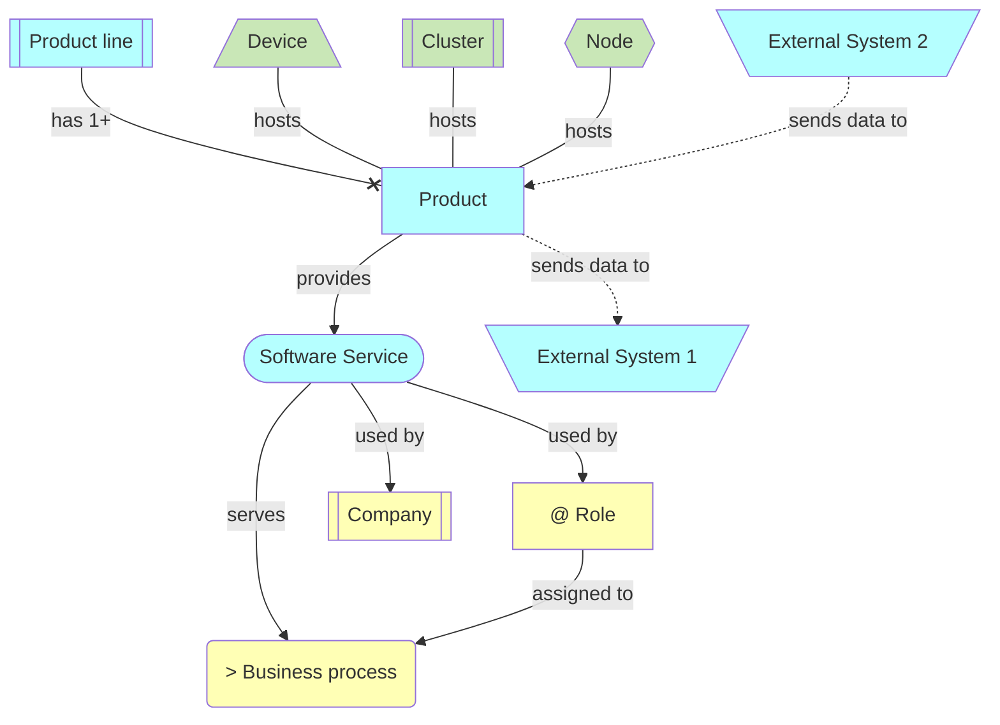
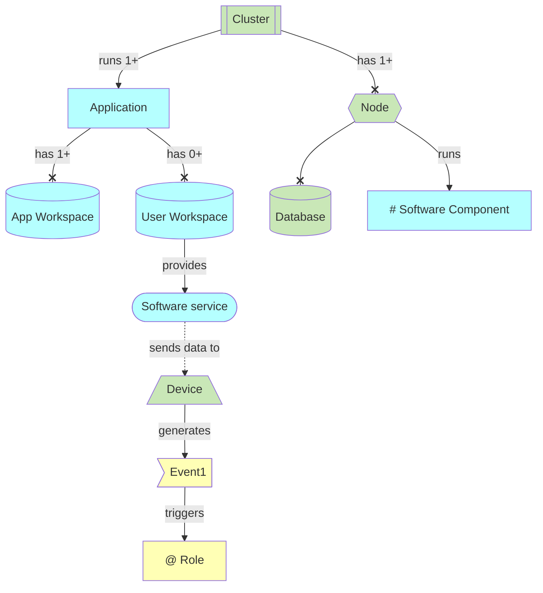
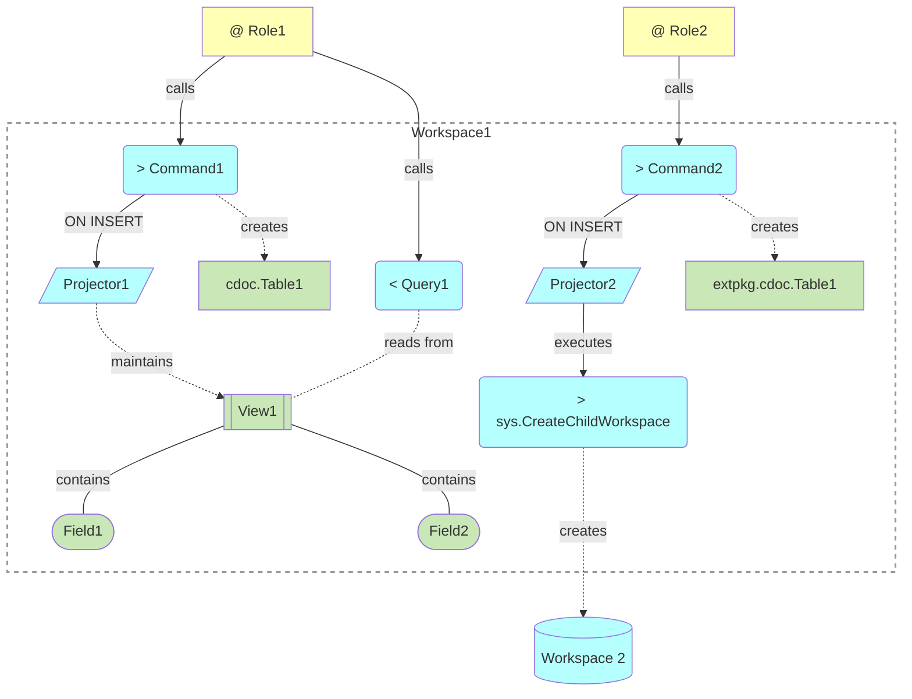

# Copilot instructions

## Markdown

- Do not add periods to markdown list items
- Add an empty line before markdown lists
- Use sentence capitalization style
- Capitalize previously defined terms
- Do not use numbers in headers

## Go

- Use go 1.24 and above features
- Use `for <idx> = range(<expr>)` whenever appropriate instead of `for <idx> := 0; idx <... ; idx ++`)

## C4 diagrams notation

Notation is based on:
- [ArchiMate](https://en.wikipedia.org/wiki/ArchiMate) (/ˈɑːrkɪmeɪt/ AR-ki-mayt; originally from Architecture-Animate), open and independent enterprise architecture modeling language
  - Brief description: [ArchiMate Metamodel For Enterprise Development](https://www.hosiaisluoma.fi/blog/archimate-metamodel/)
- [Entity–relationship model](https://en.wikipedia.org/wiki/Entity%E2%80%93relationship_model), describes interrelated things of interest in a specific domain of knowledge
- [C4 model](https://c4model.com/) for visualising software architecture

### C1: Context

Cluster, products, services, roles

### C2: Containers

Nodes, databases, workspaces, software components

### C3: Components

Views, projectors, tables, fields

