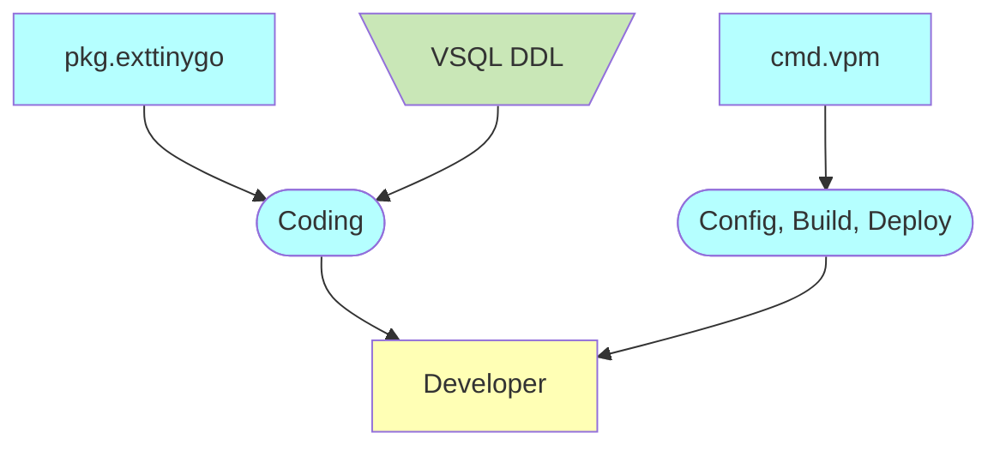

# Introduction

This documentation provides a detailed description of the design and architecture of the Voedger platform.  It serves as a reference for developers and includes the latest designs, which may still be not implemented.

For user-focused documentation and guidance on using the Voedger platform, please visit [here](https://docs.voedger.io/).

The documentation is written around the following concepts:
"The documentation is organized around the following key concepts:
- **Service**: Provided by Voedger.
    - There are Operation and Development services.
- **Role**: Which consumes the services.
- **Architecture**: The specific software architecture upon which Voedger is built.
- **Voedger Concepts**: Complex concepts that may not be designed and used as a part of the particular product service.

## Operation Services

## Development Services

Prefixes
- *cmd*: command line utility
- *mod*: Go module
- *pkg*: Go package
- *extsoft*: external software