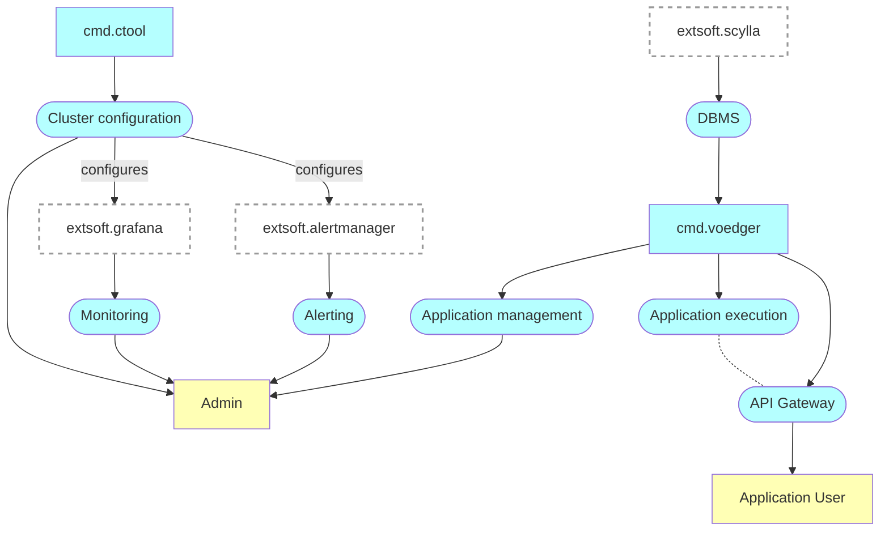
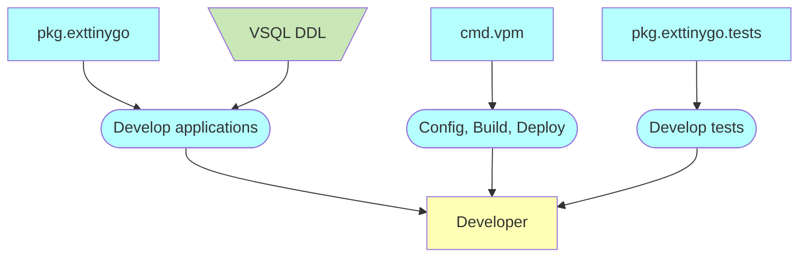

# Introduction

This documentation provides a detailed description of the internal design and architecture of the Voedger platform.  It serves as a base for the development and includes the latest designs, which may still be not implemented.

Voedger platform consists of **Voedger Framework** and **Voedger Server** that helps to develop and operate distributed applications.

For user-focused documentation and guidance on using the Voedger platform, please visit [here](https://docs.voedger.io/).

To read about the notation used visit [here](https://docs.voedger.io/concepts/notation).

## Voedger Server

## Voedger Framework

Prefixes
- *cmd*: command line utility or server
- *mod*: Go module
- *pkg*: Go package
- *extsoft*: external software