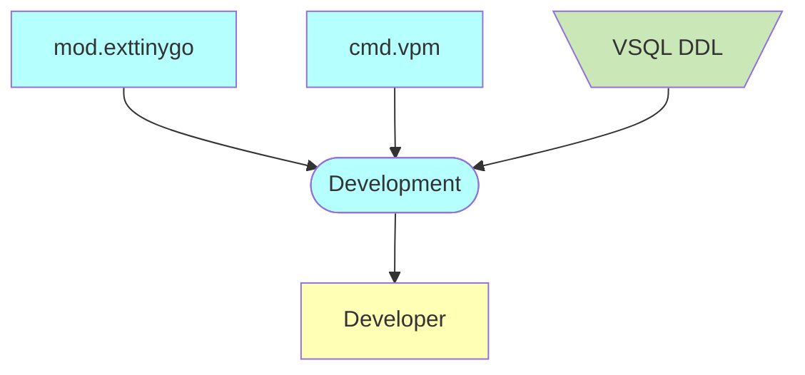
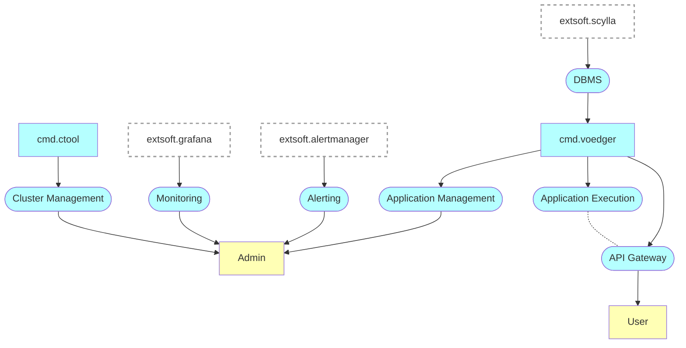

# Introduction

This documentation provides a detailed overview of the internal design and architecture of the Voedger platform.

For user-focused documentation and guidance on using the Voedger platform, please visit [here](https://docs.voedger.io/).

## Roles & Services

### Development Services

### Operation Services

Prefixes
- *cmd*: command line utility
- *mod*: Go module
- *extsoft*: external software