# Introduction

This documentation provides a detailed description of the internal design and architecture of the Voedger platform.  It serves as a base for the development and includes the latest designs, which may still be not implemented.

**Voedger Platform** consists of [Voedger Framework](framework/README.md) and [Voedger Server](server/README.md) which helps to develop and operate distributed applications.

```mermaid
    graph TD

    %% Entities ====================

    Voedger[["Voedger Platform"]]:::S
    VoedgerFramework["Voedger Framework"]:::S
    VoedgerServer["Voedger Server"]:::S

    Operation(➡️Operation):::B
    Development(➡️Development):::B

    Admin[👤Admin]:::B
    User[👤Application User]:::B
    Developer[👤Developer]:::B

    %% Relations ====================

    Voedger --- VoedgerFramework
    Voedger --- VoedgerServer

    VoedgerServer --> Operation
    VoedgerFramework --> Development

    Development --- Developer
    Operation --- Admin
    Operation --- User


    classDef B fill:#FFFFB5,color:#333
    classDef S fill:#B5FFFF,color:#333
    classDef H fill:#C9E7B7,color:#333
    classDef G fill:#ffffff15, stroke:#999, stroke-width:2px, stroke-dasharray: 5 5
```

## Additional resources

- [Voedger Reference Guide](https://docs.voedger.io/): User-focused documentation and guidance
- [Notation](https://docs.voedger.io/concepts/notation): Explains the notation conventions