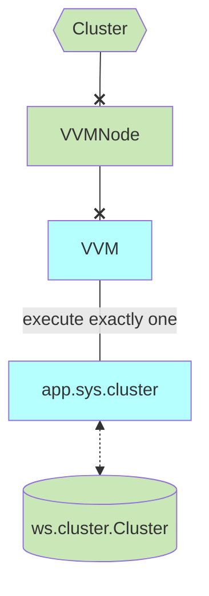
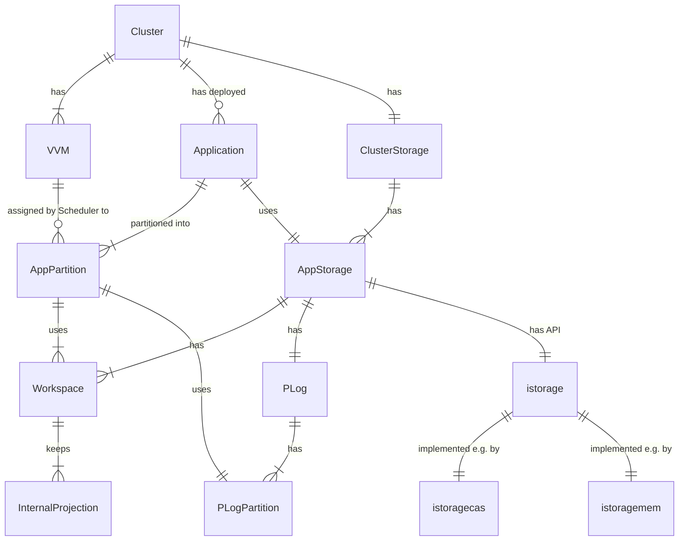
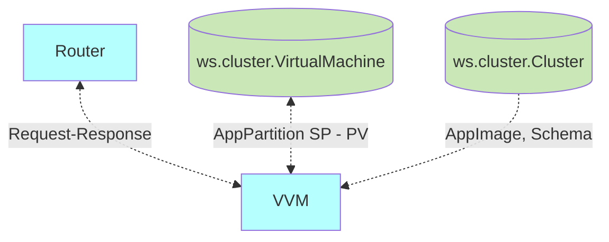
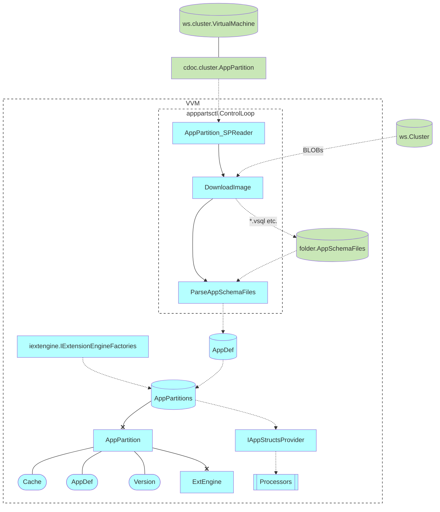

# Cluster

## Key Cluster components

```mermaid
flowchart TD

  %% Entities =================================


  Cluster{{Cluster}}:::H
  VVMNode:::H
  
  app.sys.cluster[app.sys.cluster]:::S
  ws.cluster.Сluster[(ws.cluster.Сluster)]:::H
  
  VVM:::S


  %% Relations =================================

  Cluster --x VVMNode
  VVMNode --x VVM

  VVM --- |execute exactly one| app.sys.cluster
  app.sys.cluster <-.-> ws.cluster.Сluster
  
  

  classDef G fill:#FFFFFF,stroke:#000000, stroke-width:1px, stroke-dasharray: 5 5
  classDef B fill:#FFFFB5,color:#333
  classDef S fill:#B5FFFF
  classDef H fill:#C9E7B7
```

## Cluster Storage components

```mermaid
    erDiagram
    Cluster ||--|{ VVM : has
    Cluster ||--o{ Application : "has deployed"
    Cluster ||--|| ClusterStorage : has
    ClusterStorage ||--|{ AppStorage : has

    Application ||--|{ AppPartition : "partitioned into"
    Application ||--|| AppStorage : "uses"
    AppPartition ||--|{ Workspace : "uses"
    AppPartition ||--|| PLogPartition : "uses"

    AppStorage ||--|{ Workspace: has
    AppStorage ||--|| PLog: has

    AppStorage ||--|| istorage: "has API"
    istorage ||--|| istoragecas : "implemented e.g. by"
    istorage ||--|| istoragemem : "implemented e.g. by"

    Workspace ||--|{ InternalProjection: keeps
    PLog ||--|{ PLogPartition : has

    VVM ||--o{ AppPartition : "assigned by Scheduler to"
```

## VVM Dataflow

```mermaid
flowchart TD

  %% Entities =================================

  Router:::S

  ws.cluster.Сluster[(ws.cluster.Сluster)]:::H
  ws.cluster.VirtualMachine[(ws.cluster.VirtualMachine)]:::H

  VVM:::S


  %% Relations =================================

  Router <-.->|Request-Response| VVM
  
  ws.cluster.VirtualMachine <-.-> |AppPartition SP - PV| VVM

  ws.cluster.Сluster -.-> |AppImage, Schema| VVM

  classDef G fill:#FFFFFF,stroke:#000000, stroke-width:1px, stroke-dasharray: 5 5
  classDef B fill:#FFFFB5,color:#333
  classDef S fill:#B5FFFF
  classDef H fill:#C9E7B7
```

## apppartsctl.ControlLoop

```mermaid
flowchart TD

  %% Entities =================================

  ws.cluster.VirtualMachine[(ws.cluster.VirtualMachine)]:::H
  ws.Cluster[(ws.Cluster)]:::H
  cdoc.cluster.AppPartition:::H

  VVM:::G
  subgraph VVM
    ControlLoop_AppPartition:::G
    subgraph ControlLoop_AppPartition["apppartsctl.ControlLoop"]
      AppPartition_SPReader:::S
      DownloadImage:::S
      ParseAppSchemaFiles:::S
      DownloadImage --> ParseAppSchemaFiles
    end
    AppSchemaFiles[(folder.AppSchemaFiles)]:::H
    AppDef[(AppDef)]:::S
    AppPartitions[(AppPartitions)]:::S
    AppPartition:::S
      Cache([Cache]):::S
      AppSchema(["AppDef"]):::S
      Version([Version]):::S
    ExtEngine:::S
      
    IAppStructsProvider:::S
    Processors[[Processors]]:::S


    ExtensionEngineFactories["iextengine.IExtensionEngineFactories"]:::S

  end


  %% Relations =================================

  ws.cluster.VirtualMachine --- cdoc.cluster.AppPartition
  cdoc.cluster.AppPartition -.-> AppPartition_SPReader
  AppPartition_SPReader --> DownloadImage

  ws.Cluster -.-> |BLOBs| DownloadImage
  DownloadImage -.-> |*.vsql etc.| AppSchemaFiles
  AppSchemaFiles -.-> ParseAppSchemaFiles
  ParseAppSchemaFiles -.-> AppDef

  AppPartitions --x AppPartition
  AppPartition --- Cache
  AppPartition --- AppSchema
  AppPartition --- Version
  AppPartition --x ExtEngine

  AppPartitions -.-> IAppStructsProvider
  IAppStructsProvider -.-> Processors
  ExtensionEngineFactories -.-> AppPartitions
  AppDef -.-> AppPartitions
  

  classDef G fill:#FFFFFF,stroke:#000000, stroke-width:1px, stroke-dasharray: 5 5
  classDef B fill:#FFFFB5,color:#333
  classDef S fill:#B5FFFF
  classDef H fill:#C9E7B7
```