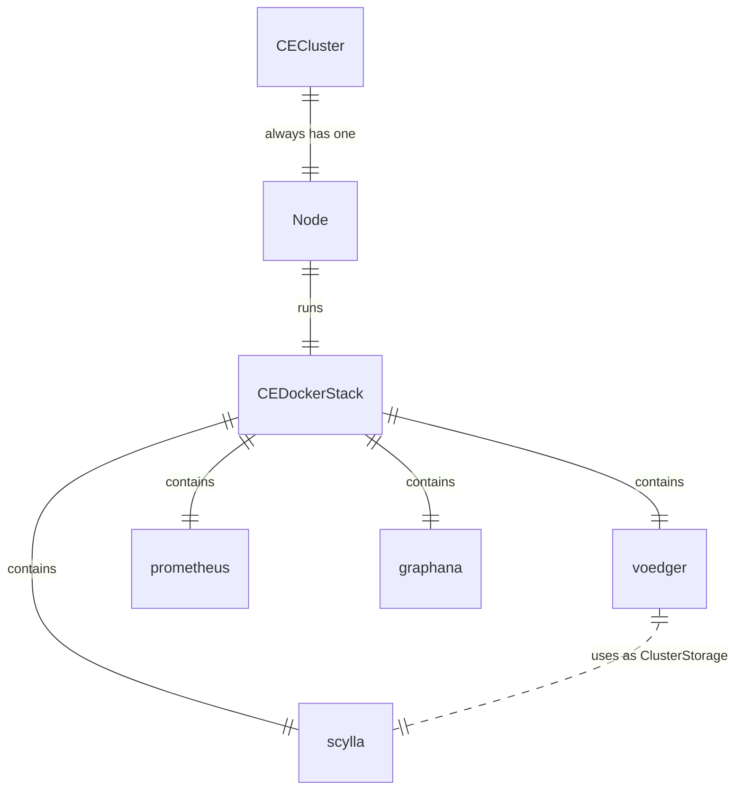

# Community Edition (CE)

Principles

- Node can run other software, unlike the SE (all nodes must be clean)
- Docker
  - So we won't support FreeBSD as a host OS
  - Reason: We beleive (paa) that FreeBSD is for things like routers
- Scylla as a ClusterStorage  
  - Reason: We do not want to learn how to operate bbolt
- Scylla is also containerized
  - Reason: [The cost of containerization is within 10%](https://scylladb.medium.com/the-cost-of-containerization-for-your-scylla-a24559d17d01), so ok

