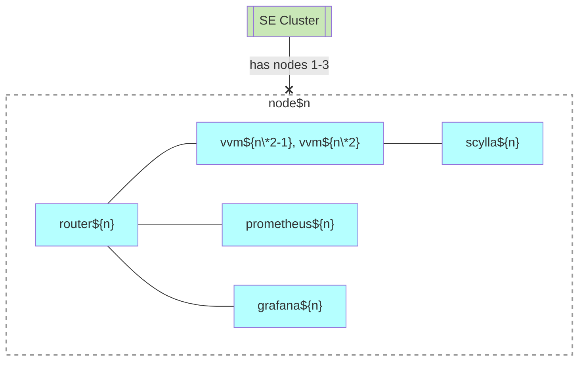

# Standart Edition (SE)

## Motivation

- [Peer-to-peer cluster](https://github.com/voedger/voedger/issues/1891)
  - 5 nodes, one application server, 3 database servers. The load is unevenly distributed, one app node is idle.
  - 3 nodes, one application server, 3 database servers. The load is unevenly distributed, one node can be overloaded.
- Failed: [Design "peer nodes" ctool principles](https://github.com/voedger/voedger/issues/2550)

## Principles

- Number of nodes: 3, peer-to-peer cluster.
- Node must be a clean Ubuntu node.
  - Reason: We believe it will avoid possible conflicts between installed software and reduce operation costs.
- Cloud-Managed Load Balancer is needed (e.g.  Amazon Elastic Load Balancer, Google Cloud Load Balancer, [Hetzner Load Balancer](https://www.hetzner.com/cloud/load-balancer))
- Orchestrator: Docker Swarm
  - Every node is a manager
- Number of VVMs
  - 6 or 1 (legacy mode).
  - Fixed, can not be changed yet.
- Monitoring
  - 3 prometheus, 3 grafana
- DMBS: Scylla
- Scylla cluster is always logically stretched
  - One ore three physical datacenters.
  - There are always two logical datacenters (scylla configuarion).
- Routing
  - Each node runs a router task.
  - We beleive that nginx would be a good choice but it is not used yet (too difficult to develop and maintain, maybe in the future).
  - We use a voedger image with a certain CLI option to run a router task.

## Nodes & Swarm Services

