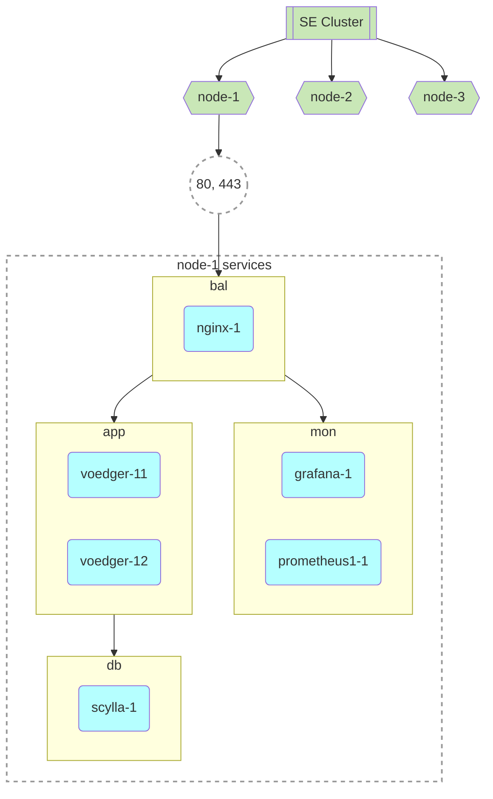

# Standart Edition (SE)

TOC

- [Principles](#principles)
- [Nodes & Swarm Services](#nodes--swarm-services)
- [grafana Service](#grafana-service)

## Principles

- Node must be a clean Ubuntu node
  - Reason: We believe it will avoid possible conflicts between installed software and reduce operation costs
- Cloud Service Provider Balancer is needed (e.g.  https://www.hetzner.com/cloud/load-balancer)
- Orchestrator: swarm
  - Every node is a manager


## Nodes & Swarm Services



```mermaid
flowchart TD

