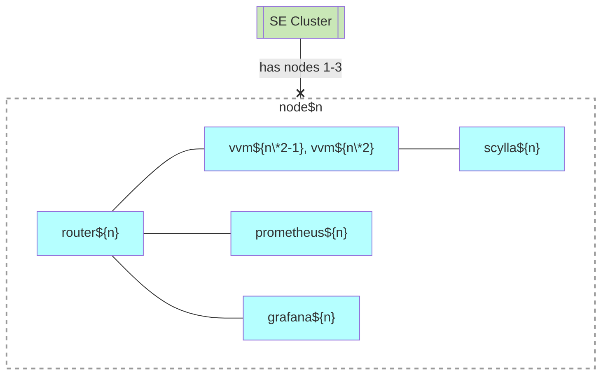

# Standard Edition (SE)

## Motivation

The need for new Standard Edition architecture arose from challenges encountered in the [previous architecture](se1.md):

- [Peer-to-peer cluster](https://github.com/voedger/voedger/issues/1891) implementation revealed load distribution issues:
  - In a 5-node setup with one application server and 3 database servers, one application node remained idle
  - In a 3-node setup with one application server and 3 database servers, uneven load distribution led to potential node overload
- The initiative to [Design "peer nodes" ctool principles](https://github.com/voedger/voedger/issues/2550) was unsuccessful

## Technical design

### Core infrastructure

The Standard Edition implements:

- A 3-node peer-to-peer cluster
- 6 VVMs (fixed configuration, not modifiable currently)
- Clean Ubuntu nodes as a requirement
  - This decision aims to minimize software conflicts and reduce operational costs

### Components and Services

#### se.load-balancer

`dsn~se.load-balancer~1`

The system’s load balancing layer must be provided by a cloud-managed load balancer solution, such as Amazon Elastic Load Balancer, Google Cloud Load Balancer, or [Hetzner Load Balancer](https://www.hetzner.com/cloud/load-balancer).

#### se.orchestration

##### se.orchestration.swarm

`dsn~se.orchestration.swarm~1`

The system uses Docker Swarm for orchestration

##### se.orchestration.allmgrs

`dsn~se.orchestration.allmgrs~1`

All nodes function as managers

#### se.monitoring

- Monitoring:
  - 3 Prometheus instances
  - 3 Grafana instances

- Database:
  - DBMS: Scylla
  - Scylla cluster configuration:
    - Physical deployment: One or three datacenters
    - Logical configuration: ??? Always maintains two datacenters (Scylla configuration)

- Routing implementation:
  - Router task runs on each node
  - Current solution uses Voedger image with specific CLI options for routing
  - Note: The possibility of using Nginx is being considered, but the implementation has been postponed due to the complexity of development and maintenance

## Nodes & Swarm Services

