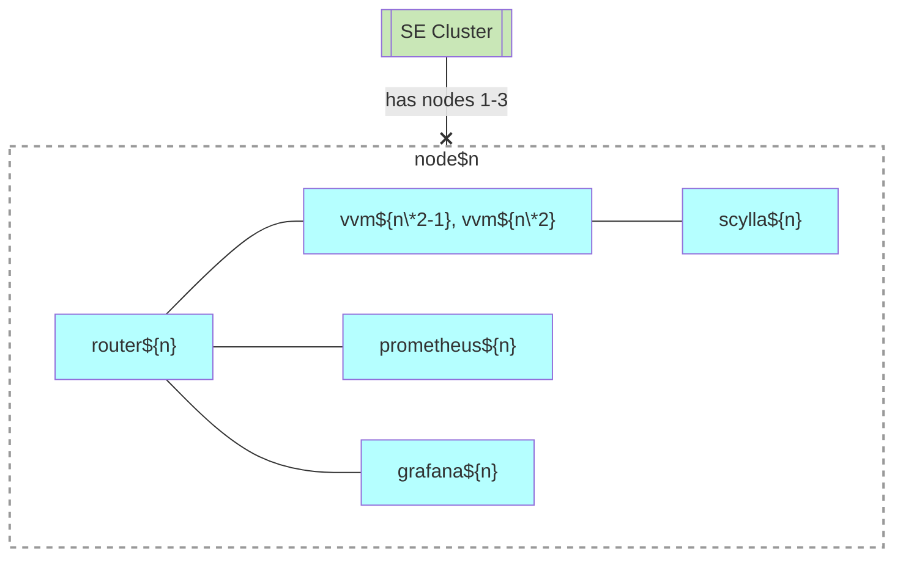

# Standart Edition (SE)

## Motivation

- [Peer-to-peer cluster](https://github.com/voedger/voedger/issues/1891)
  - 5 nodes, one application server, 3 database servers. The load is unevenly distributed, one app node is idle.
  - 3 nodes, one application server, 3 database servers. The load is unevenly distributed, one node can be overloaded.
- Failed: [Design "peer nodes" ctool principles](https://github.com/voedger/voedger/issues/2550)

## Principles

- 3 nodes.
- Node must be a clean Ubuntu node.
  - Reason: We believe it will avoid possible conflicts between installed software and reduce operation costs.
- Cloud Service Provider Balancer is needed (e.g.  https://www.hetzner.com/cloud/load-balancer)
- Orchestrator: swarm
  - Every node is a manager
- Number of VVMs
  - 6 or 1 (3-node cluster: 2 per node).
  - Fixed, can not be changed yet.
- Monitoring
  - 3 prometheus.
  - 1  grafana, always use "local" prometheus. If it starts on node1 use prometheus1, If it starts on node2 use prometheus2 etc.
- Always stretched cluster.
- nginx is not used yet.
  - Too difficult to develop and maintain, maybe in the future.

## Nodes & Swarm Services

