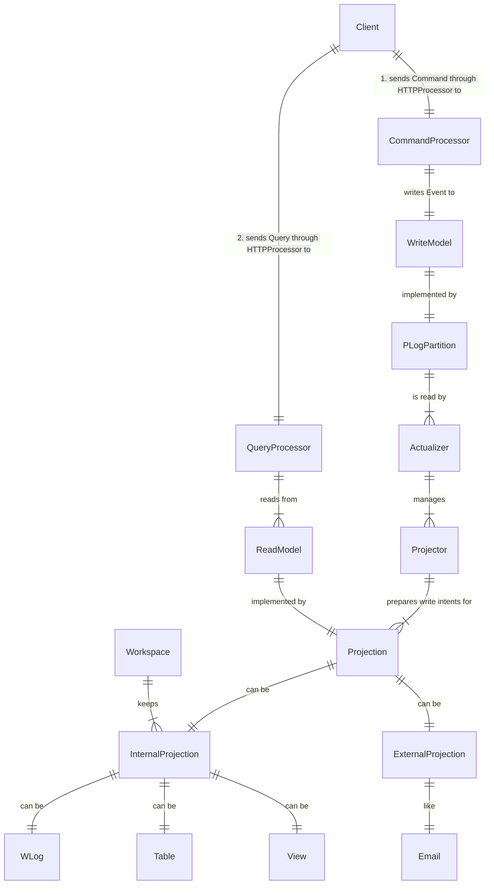

# Event Sourcing & CQRS

## Event Sourcing

- Event Sourcing is a design pattern where all changes to the application state are stored as a sequence of events

> Event Sourcing ensures that all changes to application state are stored as a sequence of events.
>
> [Martin Fowler: Event Sourcing](https://martinfowler.com/eaaDev/EventSourcing.html)
> 

- Storing a log of all events provides an "natural" **audit trail** (журнал аудита, контрольный журнал) ([link](https://arkwright.github.io/event-sourcing.html#audit-trail))
- Partitioning PLog into PLogPartition provides horizontal **scalability**

## CQRS

- CQRS (Command and Query Responsibility Segregation) is a design pattern where different data models are used for writes (by Commands) and reads (by Queries)
- Implementing CQRS in your application can maximize its **performance, scalability, and security** ([CQRS pattern, learn.microsoft.com](https://learn.microsoft.com/en-us/azure/architecture/patterns/cqrs))

## Event Sourcing + CQRS

