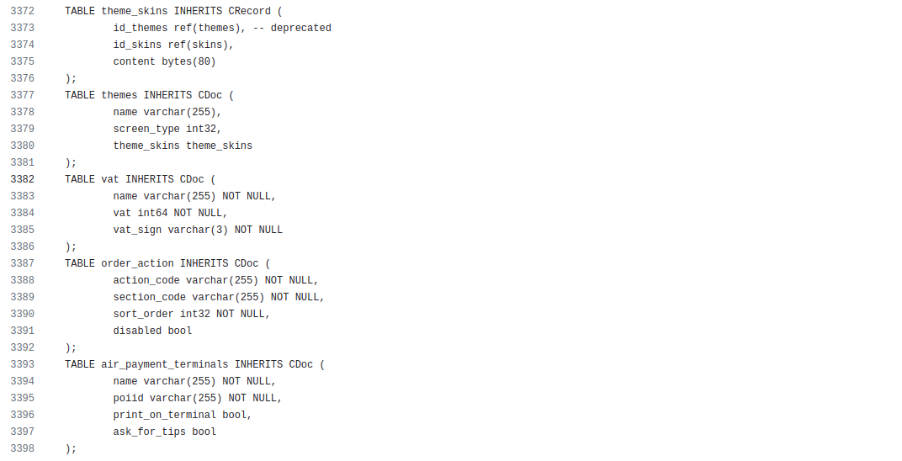

# Motivation

Technical overview - what is Voedger, how it helps us, how it can be used by you

Here's a refined version of your text for clarity and readability:

## Jump to the Clouds

Voedger was initially designed by unTill Software Development Group B.V. (unTill) in the early 2020s. At that time, unTill provided a mature "desktop" POS solution (unTill Prime) for the European market and sought to develop a cloud version and to expand into other markets.

Technical characteristics of unTill Prime:

- Over 1 million lines of code (including the "frontend")
- Database Management System: Firebird
- More than 400 tables
- Over 3000 lines of Data Definition Language (DDL)

## Requirements

### Distributed data

- It shall be possible to create clusters all over the world

### Federation

- Users shall be able to work with their data across clusters transparently.

**Example:**

- A Restaurant Owner shall be able to create a profile (Restaurant Owner Workspace) in any cluster, ideally one that is closer to the owner's location
- The Restaurant Owner shall also be able to create Restaurants (Restaurant Workspaces) in any cluster, ideally one that is closer to the restaurant's location, regardless of where the Restaurant Owner Workspace was initially created

### Fault Tolerance

- If a database node goes down, data shall NOT be lost

This requirement means that every piece of data must be stored in multiple copies, and only synchronous replication shall be used.

### Resilience

- If a datacenter goes down, clients shall not experience any downtime.
- If a database node goes down, clients shall not experience any downtime.
- If an application node goes down:
  - Clients shall experience downtime of less than 5 minutes.
  - Performance shall be fully restored within 10 minutes.

### Performance

- Each datacenter shall support 10,000 restaurants.
- It is estimated that, on average, a restaurant generates 2,000 operations (orders, payments, etc.) per day.
- Therefore, a cluster must handle 20,000,000 operations per day, averaging 230 operations per second, with peaks up to 2,000 operations per second.

Additionally, the cost of the hardware must be reasonable. Although the cost will be included in the price of the POS system subscription, it is desirable to minimize infrastructure-related operation costs to remain competitive with other POS systems.

### Edge Computing

- The system shall be installable at the "edge" (e.g., in a restaurant) and able to synchronize with the cloud.
- Data loss is acceptable for the Edge Device.
- For large restaurants, it shall be possible to build a Private Cloud (Cluster), meeting Fault Tolerance and Resilience requirements.

In practice, our cloud server software must run on typical, relatively weak POS hardware with Android OS.

### Event Sourcing

- All changes to the application state shall be stored as a sequence of events.
- In some cases, the sequence of events will be cryptographically signed to meet legal requirements.

This is a common requirement for POS systems as it provides a natural audit trail. While highly beneficial for applications across various domains, it adds extra complexity to the project. From our observations of other projects, this feature is often added in the later stages of development if the project succeeds.

## Analysis

Analyzing the requirements, we identified the need for a Modern Tech Stack:

Using this stack, we could have built the system, but it would take man-years to develop. We agreed to invest these resources, as did our colleagues from other POS providers. However, during this process, we realized that we could create an "engine" to handle the requirements above. This engine would not only enable us to build our POS system but also allow us to bring a new product to the market. This product would enable the development of systems with similar requirements in a significantly shorter time, potentially up to 10 times faster than using just the Modern Tech Stack.