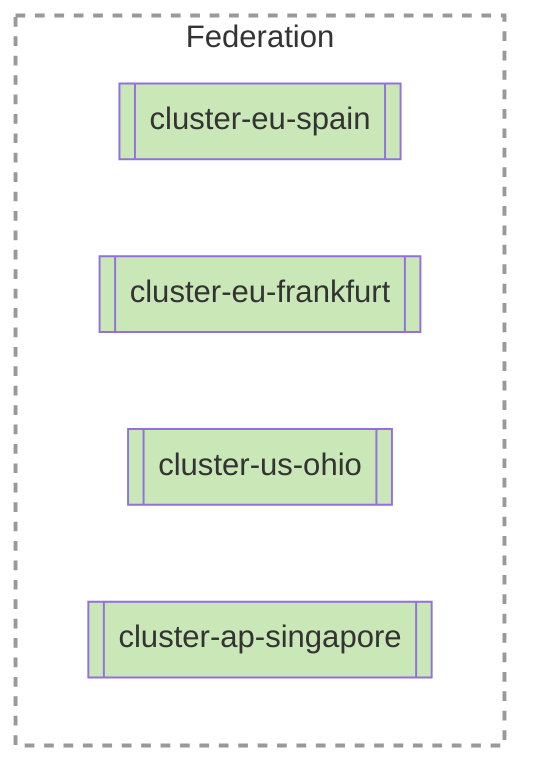
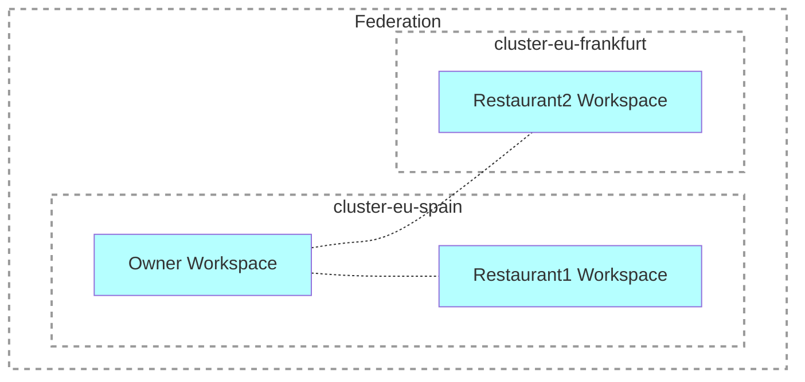
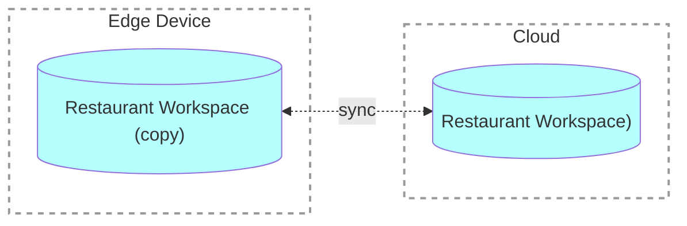

# Motivation

Here you will find out what Voedger is, how it helps us, and how it can be used by you.

---

## Jump to Clouds

Voedger was initially designed by unTill Software Development Group B.V. ([unTill](https://untill.com/)) in the early 2020s. At that time, unTill provided a mature "desktop" POS solution (unTill Prime) for the European market and sought to develop a cloud version and to expand into other markets.

Technical characteristics of unTill Prime:

- Over 1 million lines of code (including the "frontend")
- RDBMS: Firebird
- Database schema: more than 400 tables

unTill company management came up with the following requirements.

| Requirement name| Description |
| ----------- | ----------- |
| Distributed Data      | It shall be possible to create clusters to keep POS data and configuration all over the world.|
| Federation | Users shall be able to work with their data across clusters transparently.|
| Fault Tolerance | If a database node fails, data shall NOT be lost.|
|Resilience| If a datacenter or a node fails clients shall experience downtime of less than 5 minutes.|
|Performance| Each cluster shall support 10,000 restaurants.|
|Edge Computing| The system shall be installable at the "edge" (e.g., in a restaurant) and able to synchronize with the cloud.|
|Event Sourcing| All changes to the application state shall be stored as a sequence of events.|
|Zero Downtime Updates| It shall be possible to update applicaton without downtime.|

Analyzing the requirements, we identified the Modern Tech Stack:


We could have built our system using components from this stack. It would take man-years to develop - we agreed to invest these resources, as did our colleagues from other POS providers. However, during analysys and researching process, we got an idea that we could create a "generic engine" that meets the requirements above. This engine would not only enable us to build our POS system but also allow us to bring a new product to the market. This product would enable the development of systems with similar requirements in a significantly shorter time, potentially up to 10 times faster than using just the Modern Tech Stack.

We shared this idea with the colleagues from other companies ???mention, and they agreed to invest in the development of this engine.

This is how Voedger was born.

As we wanted to go public with Voedger, we needed to add some extra requirements.

| Requirement name| Description |
| ----------- | ----------- |
| Simple Coding| It shall be extremely easy to develop Voedger applications.|
| Simple Testing| It shall be extremely easy to test Voedger applications.|
| Cloud Agnostic| It shall be possible to run Voedger everywhere, including on your own infrastructure.|
| Simple Configuration| It shall be easy for Admin to build a cluster and replace a failed node.|

You can find more details about the requirements in the next sections.


### Distributed Data

- It shall be possible to create clusters to keep POS data and configuration all over the world.




### Federation

- Users shall be able to work with their data across clusters transparently.

**Example:**

- A Restaurant Owner shall be able to create a profile (Restaurant Owner Workspace) in any cluster, ideally one that is closer to the owner's location
- The Restaurant Owner shall also be able to create Restaurants (Restaurant Workspaces) in any cluster, ideally one that is closer to the restaurant's location, regardless of where the Restaurant Owner Workspace was initially created



### Fault Tolerance

- If a database node goes down, data shall NOT be lost

This requirement means that every piece of data must be stored in multiple copies, and only synchronous replication shall be used.


```mermaid
graph LR

  User[@ User]:::B
  Voedger:::S
  Node1{{Node1}}:::H
  Node2{{Node2}}:::H
  Node3{{Node3}}:::H  

  User -.-> |Data| Voedger
  Voedger -.-> |Data, copy #1| Node1
  Voedger -.-> |Data, copy #2| Node2
  Voedger -.-> |Data, copy #3| Node3


  classDef B fill:#FFFFB5,color:#333
  classDef S fill:#B5FFFF,color:#333
  classDef H fill:#C9E7B7,color:#333
  classDef G fill:#ffffff15, stroke:#999, stroke-width:2px, stroke-dasharray: 5 5
```

### Resilience

- If a datacenter or a node goes down:
  - Clients shall experience downtime of less than 5 minutes.
  - Performance shall be fully restored within 10 minutes.
  - No data loss shall occur.

This requirements are satisfied by using clusters which span multiple datacenters (**stretched clusters**)

```mermaid
graph LR

  User[@ User]:::B
  Voedger:::S
  
  Cluster:::G
  subgraph Cluster
    Datacenter1:::G
    subgraph Datacenter1
      Node1{{Node1}}:::H
    end
    Datacenter2:::G
    subgraph Datacenter2
      Node2{{Node2}}:::H
    end    
    Datacenter3:::G
    subgraph Datacenter3
      Node3{{Node3}}:::H
    end        
  end

  User -.-> |Data| Voedger
  Voedger -.-> |Data, copy #1| Node1
  Voedger -.-> |Data, copy #2| Node2
  Voedger -.-> |Data, copy #3| Node3  

  classDef B fill:#FFFFB5,color:#333
  classDef S fill:#B5FFFF,color:#333
  classDef H fill:#C9E7B7,color:#333
  classDef G fill:#ffffff15, stroke:#999, stroke-width:2px, stroke-dasharray: 5 5
```


### Performance

- Each cluster shall support 10,000 restaurants.
- It is estimated that, on average, a restaurant generates 2,000 operations (orders, payments, etc.) per day.
- Therefore, a cluster must handle 20,000,000 operations per day, averaging 230 operations per second, with peaks up to 2,000 operations per second.

Additionally, the cost of the hardware must be reasonable. Although the cost will be included in the price of the POS system subscription, it is desirable to minimize infrastructure-related operation costs to remain competitive with other POS systems.

### Edge Computing

- The system shall be installable at the "edge" (e.g., in a restaurant) and able to synchronize with the cloud.
- If an Edge Device goes down, all other devices in the restaurant shall continue to work with the cloud.
- "Minor" data loss is acceptable for the Edge Device.
- For large restaurants, it shall be possible to build a Private Cloud (Cluster), meeting Fault Tolerance and Resilience requirements.

In practice, our cloud server software must run on typical, relatively weak POS hardware with Android OS.




### Event Sourcing

- All changes to the application state shall be stored as a sequence of events.
- In some cases, the sequence of events will be cryptographically signed to meet legal requirements.

This is a common requirement for POS systems as it provides a natural audit trail. While highly beneficial for applications across various domains, it adds extra complexity to the project this is why it is not widely used.

### Zero Downtime Updates

- It shall be possible to update applicaton without downtime.

---

## Extra requriements

As we wanted to go public with Voedger, we needed to add some extra requirements.

### Development: Simple Coding

- It shall be extremely easy to develop Voedger applications.

The term "low-code" often has a bad reputation, but literally it precisely describes our goal: to develop applications with minimal coding. We want Voedger users to be free from any system-related development and focused solely on business logic.

What is still necessary to code:

- Develop schemas using Voedger DDL (similar to SQL DDL but with additional features).
- Develop business logic using the Go language, Go-files will be compiled to WASM-files and run in the Voedger Servers. We call a code that extends Voedger engines capabilities **Voedger Extension**.

For example, if you need to work with an entity such as Payment, you will need to:

- Define SQL schema for it.
- Define validation rules, such as developing a function to check if a Visit (remember we are talking about restaurants) the Payment is related to is not paid yet.

What you do NOT need to do:

- Manage which cluster/node will process a particular Payment.
- Determine which nodes will be used to save a particular Payment.
- Handle synchronization of Payments between nodes to meet Fault Tolerance requirements.
- Manage how to save and process events related to operations with Payments.
- And much, much more...

### Development: Simple Testing

- It shall be extremely easy to test Voedger applications.

**Voedger Extensions** has a design that is somehow similar to the design of the Redux reducers.

- Extension receives `IState` and `IIntents` interfaces
- `IState` reflects the current state of the system and the Action (in terms of Redux)
- `IIntents` is used to say the system that we want to update or create a new record

This way extension can be considered as a "pure function" without side effects, state can be easily mocked and intents can be easily validated.

For unit testing there is no need to run the whole system, just the extension itself.

### Operation: Cloud Agnostic

- It shall be possible to run Voedger everywhere, including on your own infrastructure.

This is a direct result of the Edge Computing requirement: if we can run Voedger on a POS device, we can run it on any cloud provider.

### Operation: Simple Configuration

- It shall be easy for Admin to build a cluster and replace a failed node.

Voedger provides a special utility called `ctool`. It expects Admin to provide the addresses of the nodes, which should have a clean Ubuntu installation, and `ctool` will handle the rest.

- To create a cluster: `ctool init <node1-address> <node2-address> <node3-address>...`
- To replace a node: `ctool replace <old-node-address> <new-node-address>`

As a result of this command all necessary software will be installed and configured on the nodes:

- Scylla/Cassandra.
- Prometheus.
- Grafana, with comprehensive dashboards out of the box.


## Trade-offs

### Node Loss Downtime

**Architecture/Design Decisions:**
- The application is divided into partitions.
- Each application partition is executed on a separate node.
- If a node goes down, all partitions have to be restarted on other nodes.

**Problem:**
- If a node goes down, it causes 2-5 minutes of downtime visible to some clients.

**Can be improved:**
- Yes, downtime can be reduced to approximately 30 seconds.

### Extensions Performance

**Architecture/Design Decisions:**
- Extensions are executed as WASM modules.
- If an extension needs to read 5 fields of some records, it has to make 6 calls to the host system—one to read the record and 5 to read the fields.
- Extension execution time is controlled by the host system (anti-freeze), which increases the host-WASM-host latency.

**Problem:**
- Each call takes 300 ns, so 3000 calls will take around 1 ms.
- ??? Proofs

**Can be improved:**
- Yes, by not using the anti-freeze option, in which case each call takes ~10 ns.
- ??? Proofs