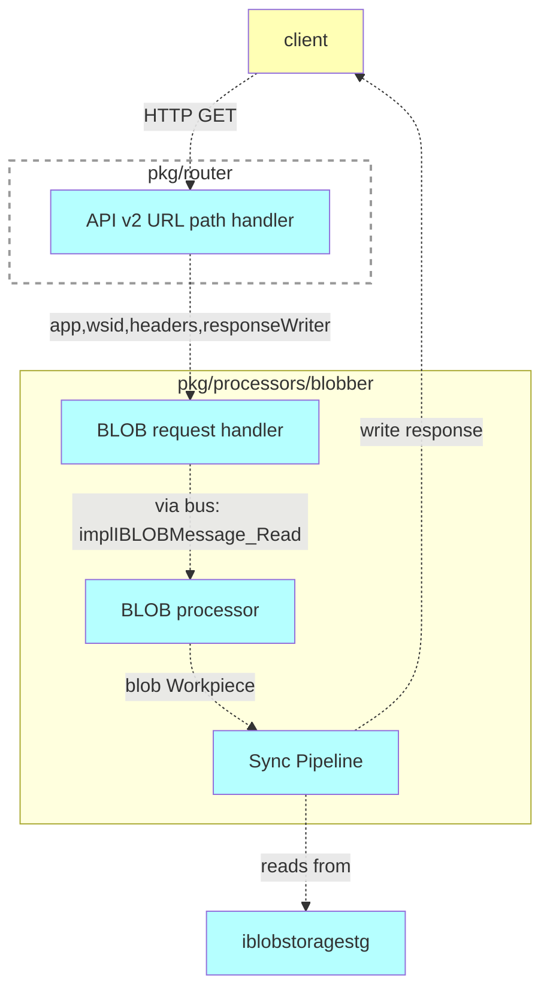

# Read/download the BLOB

## Motivation

Retrieve the BLOB from the field of a document or record, using API

## Functional design

GET `/api/v2/apps/{owner}/{app}/workspaces/{wsid}/docs/{pkg}.{table}/{id}/blobs/{fieldName}`

### Headers / Cookies

Authorization is supported via Bearer token. The token can be passed in the `Authorization` header or as a cookie. The token is obtained during the authentication process.

| Key | Value | Description |
| --- | --- | --- |
| Authorization | Bearer {PrincipalToken} | The token obtained during the authentication process |

### Parameters

| Parameter | Type | Description |
| --- | --- | --- |
| owner | string | name of a user who owns the application |
| app | string | name of an application |
| wsid | int64 | the ID of workspace |
| pkg, table | string | identifies a table (document or record) |
| id | int64 | ID of a document or record |
| fieldName | string | name of the field containing the BLOB |

### Response Headers

| Key | Value | Description |
| --- | --- | --- |
| Content-Type | BLOB metadata| Returns the originally provided metadata |
| Blob-Name | BLOB name | Returns the originally provided name |
| Content-Length | BLOB size | Returns the BLOB size in bytes |

### Result

| Code | Description | Body |
| --- | --- | --- |
| 200 | OK | BLOB binary data |
| 400 | Bad Request | [error object](errors.md) |
| 401 | Unauthorized | [error object](errors.md) |
| 403 | Forbidden | [error object](errors.md) |
| 404 | Not Found | [error object](errors.md) |
| 429 | Too Many Requests | [error object](errors.md) |
| 500 | Internal Server Error | [error object](errors.md) |
| 503 | Service Unavailable | [error object](errors.md) |

## Technical design

### Schema

### Components

- pkg/router
  - API v2 URL path handler `~cmp.routerBlobsReadPathHandler~`covrd[^1]✅:

- pkg/processors/blobber
  - BLOB request handler :
    - interface `~cmp.blobber.IRequestHandler~`covrd[^3]✅
    - implementation: read handler for APIv2, sends messages to the bus `~cmp.blobber.implIRequestHandler_Read2~`covrd[^4]✅
  - Provide BLOB processor, which handles read and write operations for BLOBs `~cmp.blobber.ProvideService~`covrd[^5]✅
  - Sync Pipeline of the BLOB processor `~cmp.blobber.ServicePipeline~`covrd[^6]✅
    - operator getBLOBMessageRead `~cmp.blobber.ServicePipeline_getBLOBMessageRead~`covrd[^7]✅
    - operator getBLOBIDFromOwner `~cmp.blobber.ServicePipeline_getBLOBIDFromOwner~`covrd[^8]✅
      - for APIv2: gets BLOB ID from the owner by fieldname by sending request to QPv2 to bus and verifies the access rights
    - operator getBLOBKeyRead `~cmp.blobber.ServicePipeline_getBLOBKeyRead~`covrd[^9]✅
      - creates BLOB key for reading
    - queryBLOBState `~cmp.blobber.ServicePipeline_queryBLOBState~`covrd[^10]✅
      - reads and verifies BLOB state from `iblobstoragestg`
    - downloadBLOBHelper `~cmp.blobber.ServicePipeline_downloadBLOBHelper~`covrd[^11]✅
      - for APIv1: verifies token by executing `q.sys.DownloadBLOBAuthnz`
    - initResponse `~cmp.blobber.ServicePipeline_initResponse~`covrd[^12]✅
      - init response with BLOB name and content type
    - readBLOB `~cmp.blobber.ServicePipeline_readBLOB~`covrd[^13]✅
      - reads BLOB from `iblobstoragestg` and writes it to the response
    - catchReadError `~cmp.blobber.ServicePipeline_catchReadError~`covrd[^14]✅
      - handles errors

- pkg/sys/it
  - integration test for reading BLOBs
    - `~it.TestBlobsRead~`covrd[^2]✅

[^1]: `[~server.apiv2.blobs/cmp.routerBlobsReadPathHandler~impl]` [pkg/router/impl_apiv2.go:134:impl](https://github.com/voedger/voedger/blob/main/pkg/router/impl_apiv2.go#L134)
[^2]: `[~server.apiv2.blobs/it.TestBlobsRead~impl]` [pkg/sys/it/impl_blob_test.go:73:impl](https://github.com/voedger/voedger/blob/main/pkg/sys/it/impl_blob_test.go#L73)
[^3]: `[~server.apiv2.blobs/cmp.blobber.IRequestHandler~impl]` [pkg/processors/blobber/interface.go:19:impl](https://github.com/voedger/voedger/blob/main/pkg/processors/blobber/interface.go#L19)
[^4]: `[~server.apiv2.blobs/cmp.blobber.implIRequestHandler_Read2~impl]` [pkg/processors/blobber/impl_requesthandler.go:38:impl](https://github.com/voedger/voedger/blob/main/pkg/processors/blobber/impl_requesthandler.go#L38)
[^5]: `[~server.apiv2.blobs/cmp.blobber.ProvideService~impl]` [pkg/processors/blobber/provide.go:17:impl](https://github.com/voedger/voedger/blob/main/pkg/processors/blobber/provide.go#L17)
[^6]: `[~server.apiv2.blobs/cmp.blobber.ServicePipeline~impl]` [pkg/processors/blobber/impl.go:15:impl](https://github.com/voedger/voedger/blob/main/pkg/processors/blobber/impl.go#L15)
[^7]: `[~server.apiv2.blobs/cmp.blobber.ServicePipeline_getBLOBMessageRead~impl]` [pkg/processors/blobber/impl.go:21:impl](https://github.com/voedger/voedger/blob/main/pkg/processors/blobber/impl.go#L21), [pkg/processors/blobber/impl_read.go:164:impl](https://github.com/voedger/voedger/blob/main/pkg/processors/blobber/impl_read.go#L164)
[^8]: `[~server.apiv2.blobs/cmp.blobber.ServicePipeline_getBLOBIDFromOwner~impl]` [pkg/processors/blobber/impl.go:22:impl](https://github.com/voedger/voedger/blob/main/pkg/processors/blobber/impl.go#L22), [pkg/processors/blobber/impl_read.go:122:impl](https://github.com/voedger/voedger/blob/main/pkg/processors/blobber/impl_read.go#L122)
[^9]: `[~server.apiv2.blobs/cmp.blobber.ServicePipeline_getBLOBKeyRead~impl]` [pkg/processors/blobber/impl.go:23:impl](https://github.com/voedger/voedger/blob/main/pkg/processors/blobber/impl.go#L23), [pkg/processors/blobber/impl_read.go:26:impl](https://github.com/voedger/voedger/blob/main/pkg/processors/blobber/impl_read.go#L26)
[^10]: `[~server.apiv2.blobs/cmp.blobber.ServicePipeline_queryBLOBState~impl]` [pkg/processors/blobber/impl.go:24:impl](https://github.com/voedger/voedger/blob/main/pkg/processors/blobber/impl.go#L24), [pkg/processors/blobber/impl_read.go:64:impl](https://github.com/voedger/voedger/blob/main/pkg/processors/blobber/impl_read.go#L64)
[^11]: `[~server.apiv2.blobs/cmp.blobber.ServicePipeline_downloadBLOBHelper~impl]` [pkg/processors/blobber/impl.go:25:impl](https://github.com/voedger/voedger/blob/main/pkg/processors/blobber/impl.go#L25), [pkg/processors/blobber/impl_read.go:85:impl](https://github.com/voedger/voedger/blob/main/pkg/processors/blobber/impl_read.go#L85)
[^12]: `[~server.apiv2.blobs/cmp.blobber.ServicePipeline_initResponse~impl]` [pkg/processors/blobber/impl.go:26:impl](https://github.com/voedger/voedger/blob/main/pkg/processors/blobber/impl.go#L26), [pkg/processors/blobber/impl_read.go:54:impl](https://github.com/voedger/voedger/blob/main/pkg/processors/blobber/impl_read.go#L54)
[^13]: `[~server.apiv2.blobs/cmp.blobber.ServicePipeline_readBLOB~impl]` [pkg/processors/blobber/impl.go:27:impl](https://github.com/voedger/voedger/blob/main/pkg/processors/blobber/impl.go#L27), [pkg/processors/blobber/impl_read.go:109:impl](https://github.com/voedger/voedger/blob/main/pkg/processors/blobber/impl_read.go#L109)
[^14]: `[~server.apiv2.blobs/cmp.blobber.ServicePipeline_catchReadError~impl]` [pkg/processors/blobber/impl.go:28:impl](https://github.com/voedger/voedger/blob/main/pkg/processors/blobber/impl.go#L28), [pkg/processors/blobber/types.go:93:impl](https://github.com/voedger/voedger/blob/main/pkg/processors/blobber/types.go#L93)
