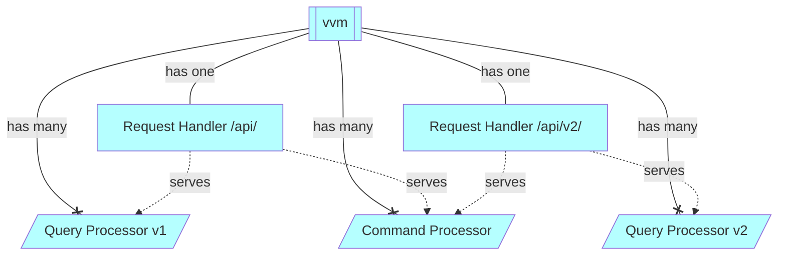
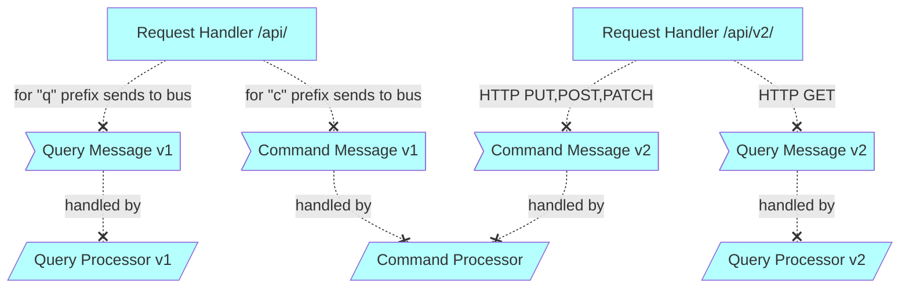

# API Gateway implementation
Design of the implementation of the API Gateway.

# Motivation
[API Gateway (APIv2)](https://github.com/voedger/voedger/issues/1162)

# Context

# Components
- Command Processor: `processors/command`
- Query Processor 1: `processors/query`
- Query Processor 2: `processors/query2`
- Request Handler `vvm/impl_requesthandler.go`

# Request dispatching

# See Also
- [Design: Query Processor](/server/design/qp.md)
- [Design: API v2](/server/apiv2/README.md)

