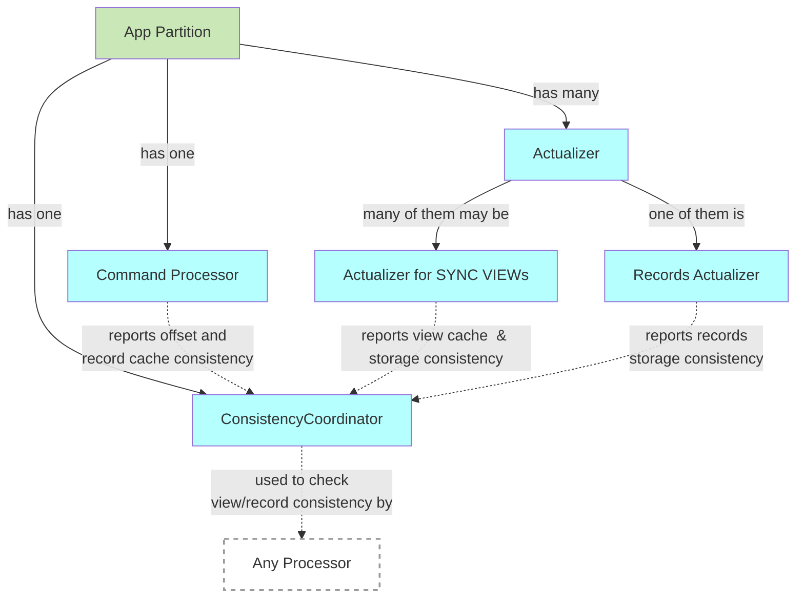

# Consistency Coordinator

## Overview

**Consistency Coordinator** is a component that coordinates consistency checks for [sync views](../views/sync-views.md) and records across different processors within the app partition.

## Technical design

### Principles



#### Interface

`~cmp.IConsistencyCoordinator~`: interface

```go
type IConsistencyCoordinator interface {

  // CommitCacheConsistency commits view or record cache consistency
  CommitCacheConsistency(entity appdef.QName, offs appdef.Offset)

  // CommitStorageConsistency commits view or record storage consistency
  CommitStorageConsistency(entity appdef.QName, offs appdef.Offset)

  // EntityConsistency returns the cache and storage consistency for the given entity (view or record)
  EntityConsistency(entity appdef.QName) (cache appdef.Offset, storage appdef.Offset)

  // CommitCpOffset is called by the Processor to commit the offset of the last processed event
  CommitCpOffset(offs appdef.Offset)

  // GetCpOffset returns the last committed offset of the Command Processor
  CpOffset() appdef.Offset
}
```

#### Implementation

`~cmp.ConsistencyCoordinator~`: implementation

## See also

- [Sync Views](../views/sync-views.md)
