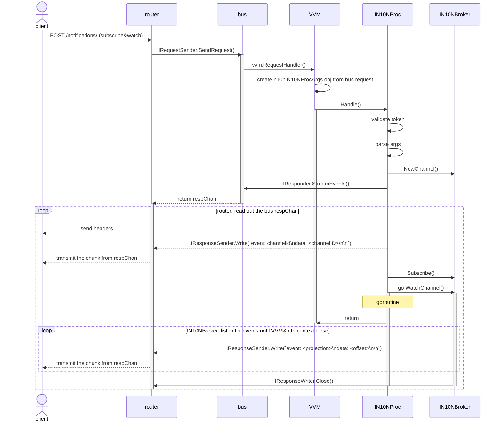

## Overview

N10N Processor is a middleware between `IN10NBroker` and `router`

## Why

- to avoid router to do the SSE handling:
  - listen for the N10N channel,
  - render events to SSE messages
  - authnz, rate limiting, manage goroutines etc

## Principles

- work via Bus
  - Router and `N10NProc` depends on Bus only
  - Router can reuse the existing Bus streaming approach (like for queries)
- no engines, no workers, no proc bus, 1 request → 1 N10N processor call in request’s goroutine
- authnz, subscribe, validate etc is done by the processor, not by the router
- router must not depend on n10n package

## Functional design

- router accepts request to `/notifications/` url part and sends the request using `bus.IBus.SendRequest`
- Bus triggers an event that is handled by VVM request handler
- VVM request handler routes request to the `IN10NProc`
- `IN10NProc` handles validation, authnz, uses `IN10NBroker` and sends response to `bus.IReponsder`
  - If expiresIn is not provided, defaults to 24 hours
  - If subscription fails, all previously subscribed projections are automatically unsubscribed
- router reads chunks from bus and just sends it to the http client (the same streaming as for queries)

## Components

- `processors/n10n/IN10NProc.Handle()`
  - no engines, no borrowing, just single interface wired on VVM create
- router `/notifications/` url path handler
  - `IBus.SendRequest(bus.Request.IsN10N=true)`
  - VVM Request Handler calls `IN10NProc.Handle()`
- `IN10NProc.Handle()` uses sync pipeline to handle the request
- error is out → `bus.ReplyErr()` and return
- subscribe-and-watch is requested ->
  - `streamer := bus.IResponser.StreamEvents()`
  - `IN10NBroker.WatchChannel()` is called in a goroutine
    - on event: `streamer.Write(string SSE message)`
    - VVM ctx or Request ctx closed → `WatchChannel` exit
    - wait for all goroutines in cleanup on VVM ctx close
- subscribe on an extra view is requested ->
  - `IN10NBroker.Subscribe()`
  - 200 ok is responded to the bus
- unsubscribe is requested ->
  - `IN10N.Unsubscribe()`
  - 204 no content is responded to the bus

## Communication schema

