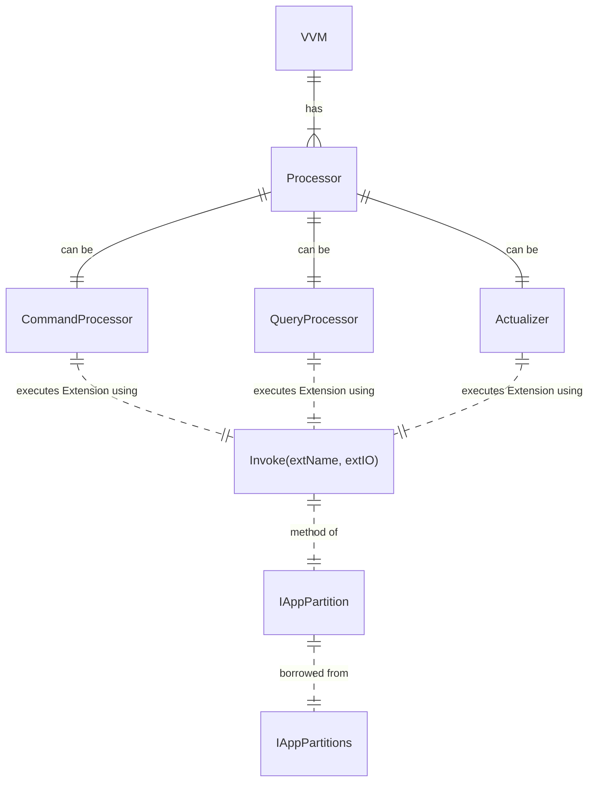
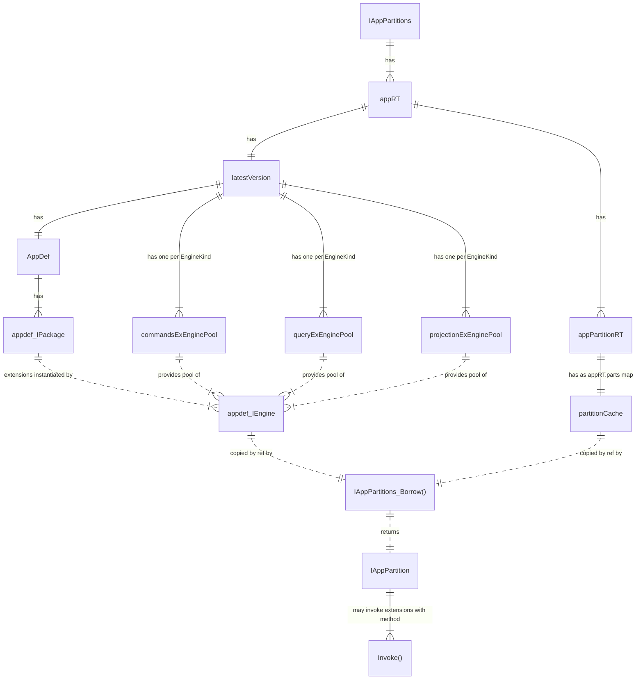
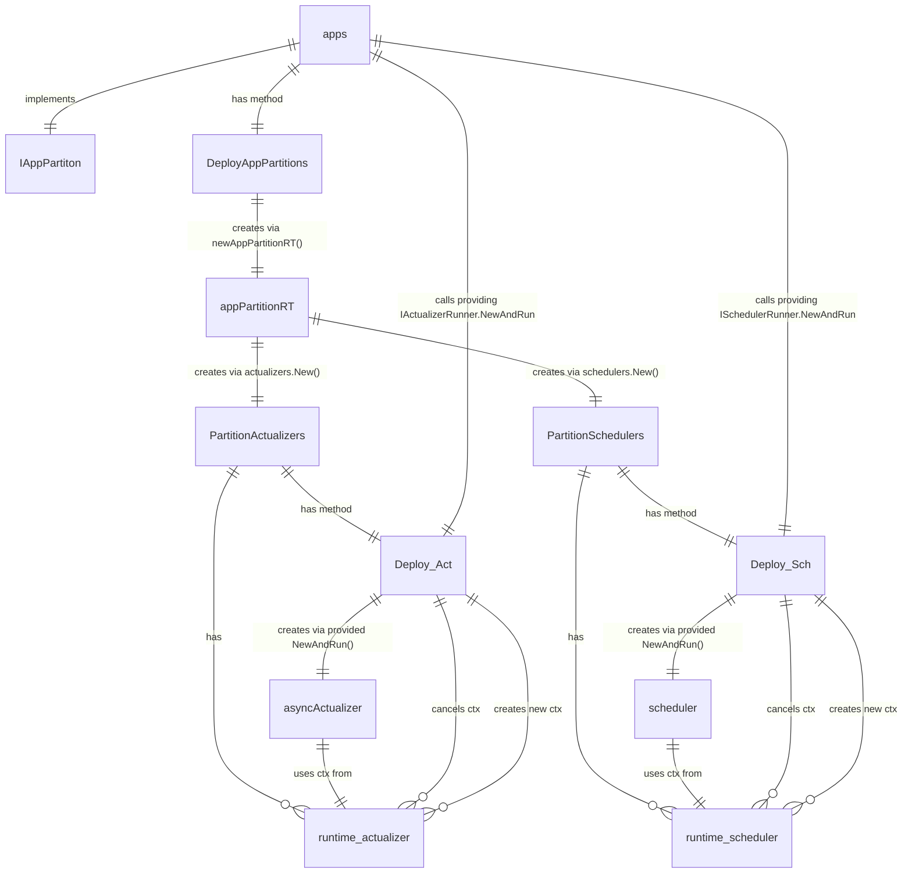

# VVM Architecture

## Processors



## IAppPartition

```go
type IAppPartitions interface {
    ...
    Borrow(qpp AppQName, part PartitionID, procKind ProcessorKind) (IAppPartition, error)
    ...
}
```



## Partition Actualizers and Schedulers Orchestration Diagram


