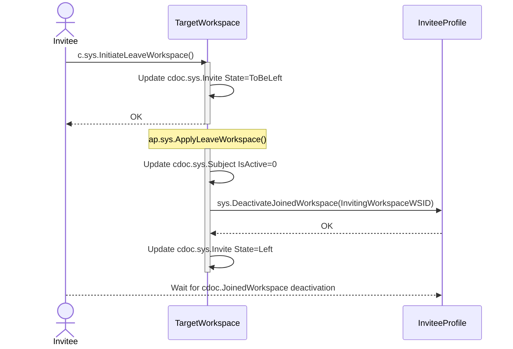

# Leave Workspace

## c.sys.InitiateLeaveWorkspace()

- AuthZ: role.sys.Subject
- Params
  - Token.Login is used to find Invite
- Errors
  - Invite not found
  - State not in (Joined)

**Behavior:**
