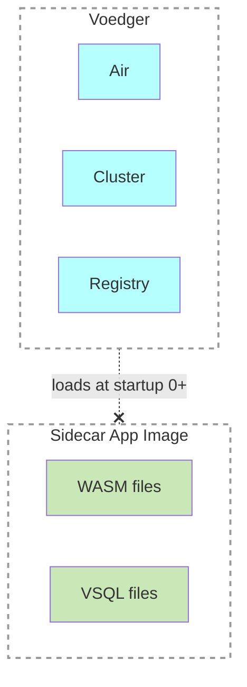

## Sidecar Applications

- **Sidecar Applications** are placed near the Voedger executable and deployed automatically when VVM starts

- Naming: after [Sidecar Containers](https://kubernetes.io/docs/concepts/workloads/pods/sidecar-containers/)
- VVMConfig.DataPath
  - 📂apps
    - 📁app1Owner.app1Name
      - 📁image // unzipped app image, the same structure as baseline, see https://github.com/voedger/voedger-internals/edit/main/framework/vpm/baseline.md
      - descriptor.json
    - 📁app2Owner.app2Name
      - 📁image // unzipped app image
      - descriptor.json

Related issues:
- [github: Sidecar Applications](https://github.com/voedger/voedger/issues/2326)      

## Functional design

- Place sidecar app files in `$dataPath/apps/`
- Provide `$dataPath` value in the `--data-path` command line argument of the host application
- Logging:
  - `sidecar app <app name> parsed`

## Technical design

- `VVMConfig.DataPath`
- `provideSidecarApps()` builds all sidecar applications if `VVMConfig.DataPath` is specified

Testing
- [Test app](https://github.com/voedger/voedger/tree/main/pkg/sys/it/testdata/apps/test2.app1)
- [BasicUsage](https://github.com/voedger/voedger/blob/9dac6b1ee066b9634985c98d249ec9d62a5b950d/pkg/sys/it/impl_sidecar_test.go#L20)

## Limitations
- Currently, the [following names](https://github.com/voedger/voedger/blob/f7ec852d5689fdf7c441bfb24e5395d52561634e/pkg/istructs/consts.go#L166) for sidecar applications are allowed:
  - test1/app1
  - test1/app2
  - test2/app1
  - test2/app2
- data of a sidecar application can not be updated by [VSqlUpdate](https://github.com/voedger/voedger-internals/blob/main/server/vsql-select-update.md) 
