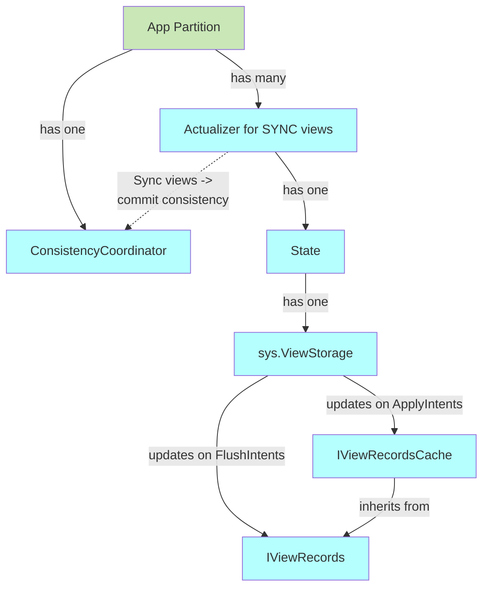
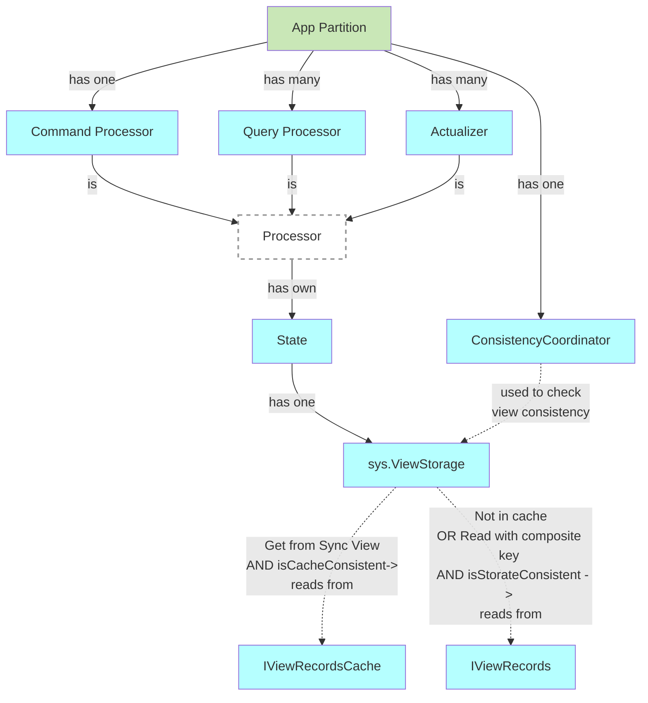
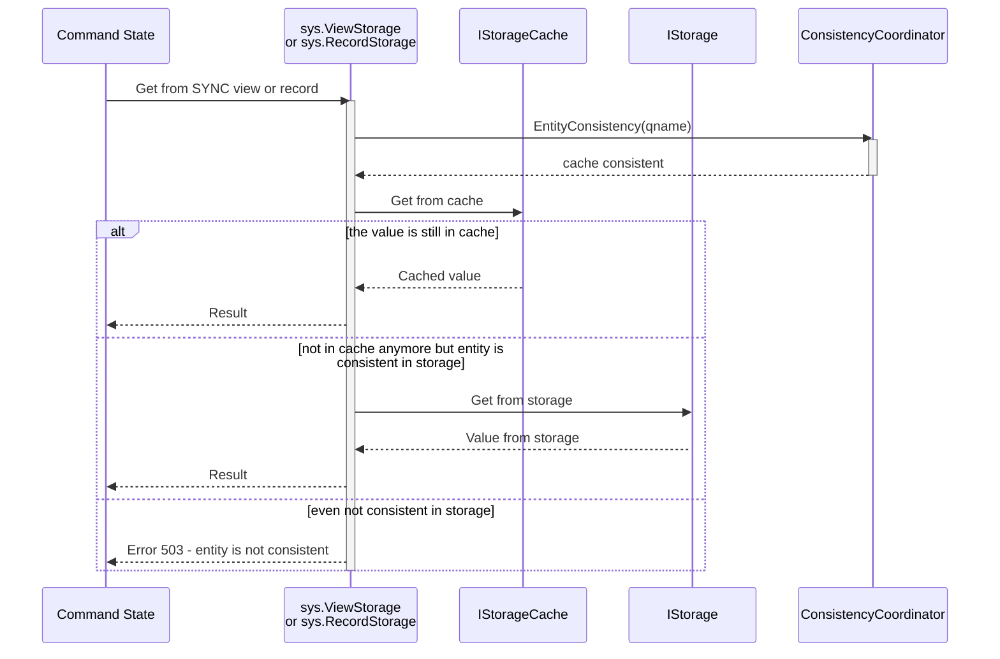
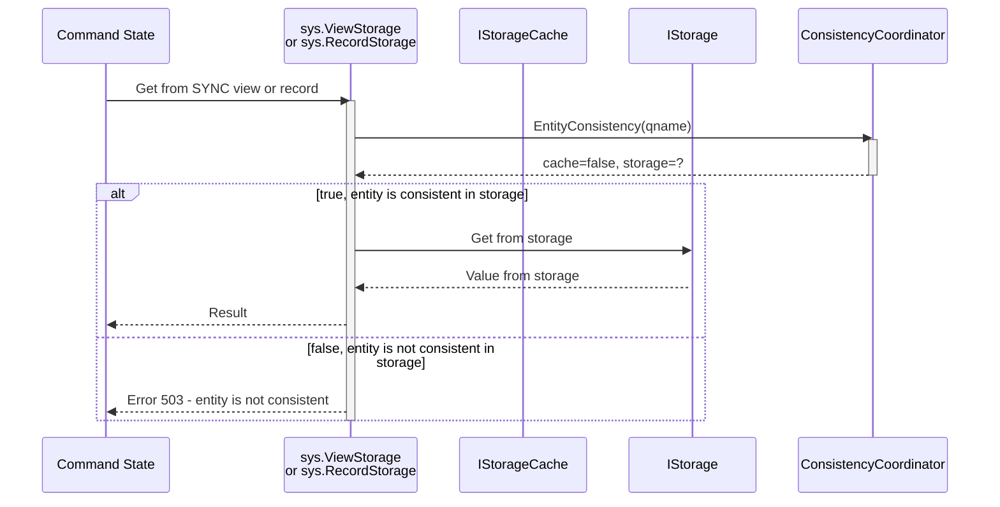

# Sync Views

Sync views are views which are synchronized with the reader offset:

- Command Processor - using the last offset processed by the Command Processor
- QP (Query Processor) - using the last offset processed by the CP when the query request starts
- Actualizer - using the last offset processed by the Actualizer

## Motivation

[Elimination of sync projectors](https://github.com/voedger/voedger/issues/3521) requires an approach to read and write from views consistently without using `SYNC` projectors.

## Principles

- `sys.StorageView` handles reading and writing to SYNC views by performing [consistency checks](../design/consistency-coordinator.md):
  - when reading, it checks the view consistency in the CACHE and STORAGE
    - There can be a timeout for waiting for consistency. The timeout is shorter in the Command Processor (CP) to ensure faster response, while other processors may use a longer timeout for consistency checks.
- Actualizer, which has declared intents to SYNC views, reports the view consistency to the [consistency coordinator](../design/consistency-coordinator.md)

## Functional design

### Sync view declaration

```sql
  /*
    - Command only allowed to read from view when VIEW is declared as SYNC (or maintained by the SYNC projector, for backward compatibility);
    - Engine controls that it is not allowed to read from a view if it not declared in STATE of the command
  */
  COMMAND MyCommand STATE(View(MyView)) INTENTS(Record(MyRecord));

  -- Sync view is a view which is synchronized with the reader offset
  SYNC VIEW MyView(
    Field1 int32,
    Field2 int64,
    Value string,
    PRIMARY KEY ((Field1), Field2)
  );

  -- Projector which updates the sync view(s) 
  PROJECTOR MyProjector AFTER EXECUTE ON COMMAND MyCommand INTENTS(View(MyView));
```

## Technical design

### Schema: reporting sync views consistency



### Schema: reading from sync views



### Components

#### Application schema

- `~cmp.AppDef~`: Support sync views, do not allow non-sync view in STATE of commands

#### Parser

- `~cmp.Parser~`: Support sync views
- `~cmp.Parser.CmdState~`: Command only allowed to read from view when VIEW is declared as SYNC (or maintained by the SYNC projector, for backward compatibility);

#### App Partition

- `~cmp.AppParts~`: Provide an instance of `IConsistencyCoordinator`

#### Command Processor

- commits the offset of the last processed event to the `ConsistencyCoordinator`

#### Actualizers

Actualizer which handles `Sync Views`:

- immediately applies intents to CACHE after every handled event
- reports view **cache consistency** with an offset of handled event when:
  - an event was handled by a projector and intents were applied to the Cache
  - an event was NOT handled by a projector (projector does not accept it) but only if intents were applied to Cache by this projector at least once before
- reports view **storage consistency**:
  - when the actualizer is initialized - with the last saved offset
  - when intents were applied to the storage (flushed) - with the last flushed offset
  - when an event was NOT handled by a projector (projector does not accept it) and the intents buffer is empty (no new intents since the last flush) - with the offset of the event that was not handled

#### View State

- Command Processor state: verifications when reading from views:
  - view is SYNC or maintained by the SYNC PROJECTOR. This way we keep the current behavior of SYNC PROJECTOR until it is fully deprecated.
  - SYNC views must be listed in STATE of the command


##### GET operation, entity is cache-consistent



##### GET operation, entity is not cache-consistent



## Test plan

- `~it.SyncViews~`

## Addressed issues

- [All projectors must be async](https://github.com/voedger/voedger/issues/3521)

## See also

- [Consistency Coordinator](../design/consistency-coordinator.md)
