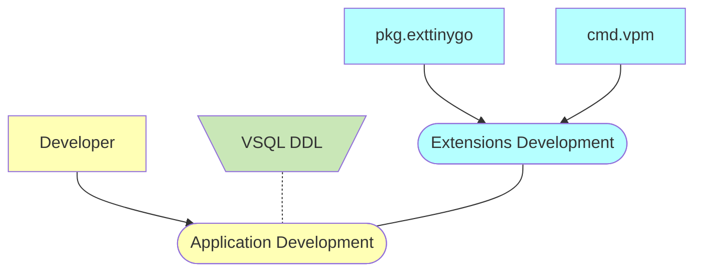

# Development Services

Prefixes
- *cmd*: command line utility
- *mod*: Go module
- *pkg*: Go package
- *extsoft*: external software

## Principles

- Function `main()` and module `main` is a must, ref. https://github.com/tinygo-org/tinygo/issues/2703
