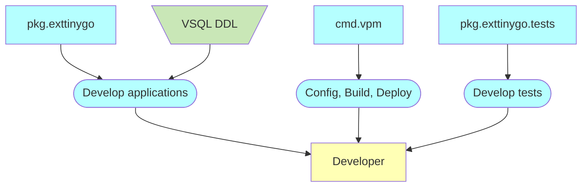

# Voedger Framework

Voedger Framework is a set of tools, libraries and conventions that enable developers to create and deploy Voedger applications.

Prefixes
- *cmd*: command line utility
- *mod*: Go module
- *pkg*: Go package
- *extsoft*: external software

## Principles

- Simplified validation (e.g. references, uniquess are not validated)

## Context

- geeksforgeeks.org: [What is a Framework?](https://www.geeksforgeeks.org/what-is-a-framework/) (Инструментарий для разработки)
- bocasay.com: [What is a development framework?](https://www.bocasay.com/what-is-development-framework)
