# Edge Computing

[redhat.com An Architect's guide to edge computing essentials](https://www.redhat.com/architect/edge-computing-essentials)

- Edge computing (периферийные вычисления, граничные вычисления) is a distributed computing pattern (модель распределенных вычислений). Computing assets on a very wide network are organized so that certain computational and storage devices that are essential to a particular task are positioned close to the physical location where a task is being executed
- Edge computing is definitely a thing in today's technical landscape. The market size for edge computing products and services has more than doubled since 2017. And, according to the statistics site, Statista, it's projected to explode by 2025. (See Figure 1, below)

[tadviser.ru: https://www.tadviser.ru/](https://www.tadviser.ru/index.php/%D0%A1%D1%82%D0%B0%D1%82%D1%8C%D1%8F:%D0%9F%D0%B5%D1%80%D0%B8%D1%84%D0%B5%D1%80%D0%B8%D0%B9%D0%BD%D1%8B%D0%B5_%D0%B2%D1%8B%D1%87%D0%B8%D1%81%D0%BB%D0%B5%D0%BD%D0%B8%D1%8F_(Edge_computing%))

- Выступая на конференции Open Networking Summit в Бельгии в сентябре 2019 года руководитель сетевых проектов Linux Foundation Арпит Джошипура (Arpit Joshipura) заявил, что периферийные вычисления станут важнее облачных к 2025 году.

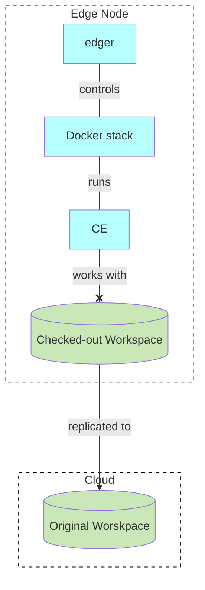


## Motivation

- Local Box: 62584
- launchpad: Edge Computing: 25305
- launchpad: cmd: edger: 25307


## Table of Contents

Concepts

- [Edge Node](#edge-node)
- [Edge Nodes Registry and Status](#edge-nodes-registry-and-status)
- [Edge Node Lifecycle](#edge-node-lifecycle)
- [Asymmetrical asynchronous replication](#asymmetrical-asynchronous-replication)
- [Edge Authentication](#edge-authentication)
- [sys_WorkspaceDescriptor_cdoc](#sys_workspacedescriptor_cdoc)
- [External Projectors](#external-projectors)
- [Synced Events](#synced-events)

Use cases

- [Check-out Workspace](#check-out-workspace)
- [Replicate Edge Workspace](#replicate-edge-workspace)
- [Initial Sync](#initial-sync)
- [Process commands](#process-commands)


## Concepts

### Edge Node

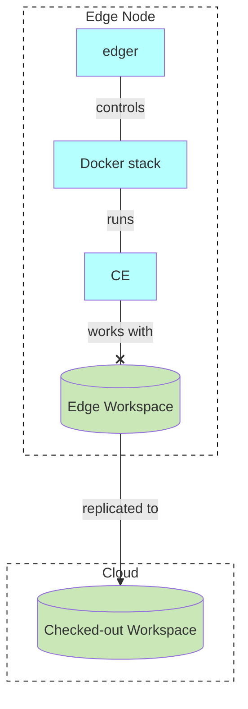
- Edge Workspace: Перефирийная рабочая область
- Checked-out Workspace: Выписанная рабочая область

### Edge Nodes Registry and Status


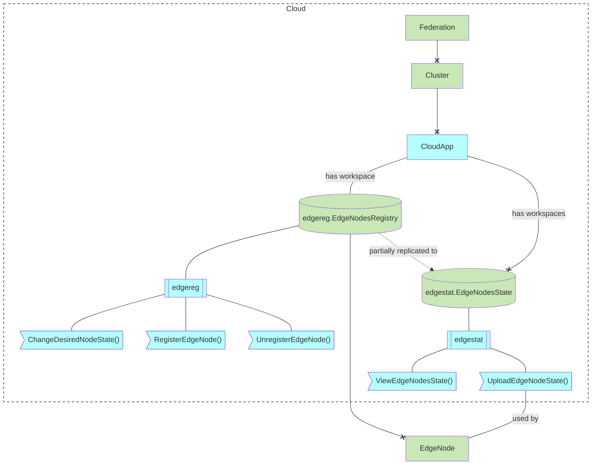

ViewEdgeNodesState()

- Sorted by CPU usage as a percentage
- Sorted by Memory usage as a percentage
- Sorted by Error state (ones with errors first)
- // TODO: Merge results from all Edge State workspaces

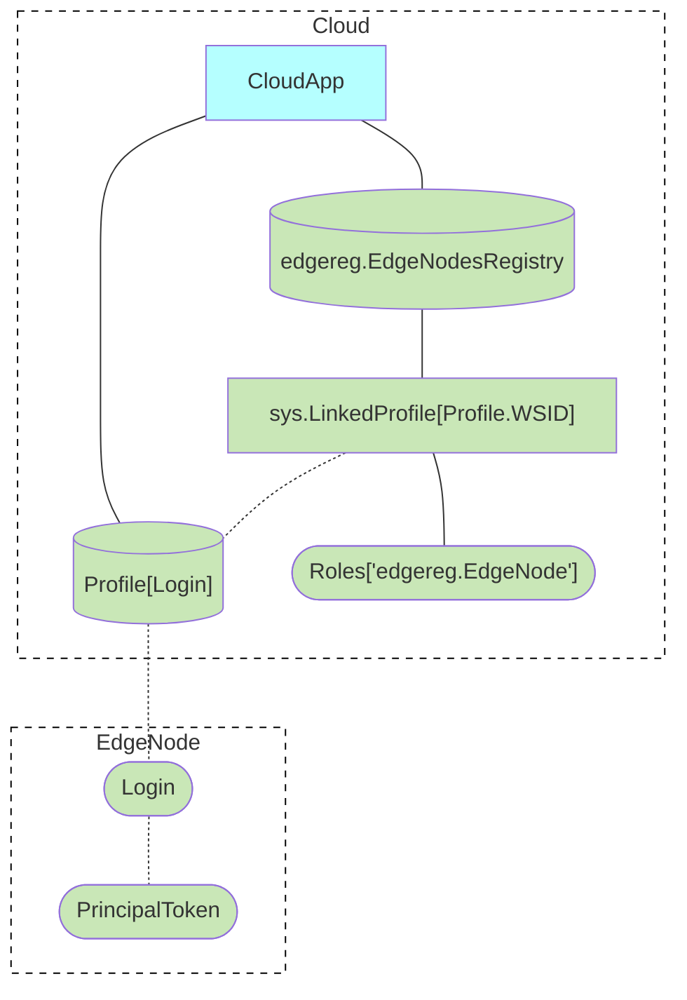


### Edge Node Lifecycle

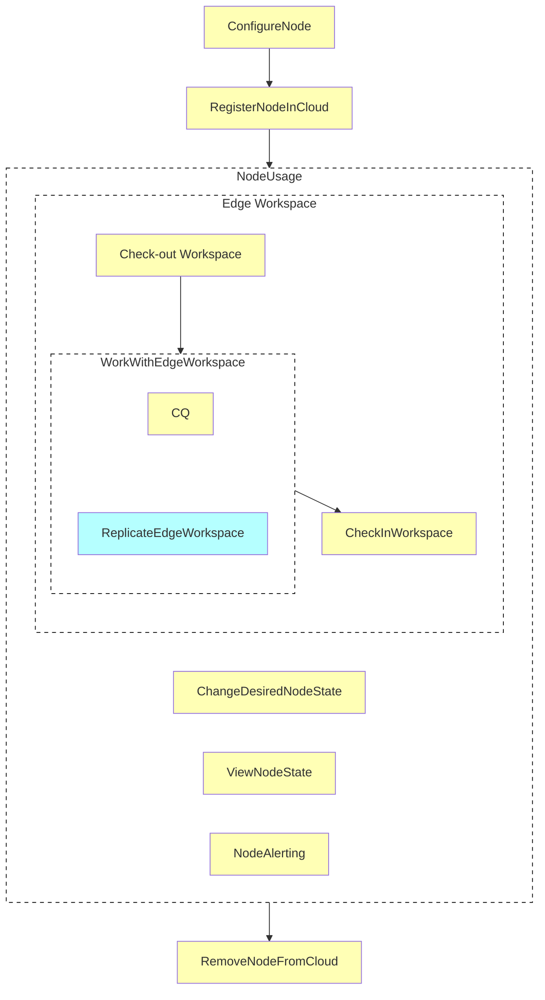

- **Check out Workspace**: Выписывание Рабочей Области
- **Check in Workspace**: Возврат Рабочей Области
- **Change Desired Node State** (software version, etc.)
- **View Node State**: Software version, etc.
- **Node Alerting**: Alerts about CPU, memory  exhaustion


### Asymmetrical asynchronous replication

- Data is replicated one direction
- Data is replicated asynchronously

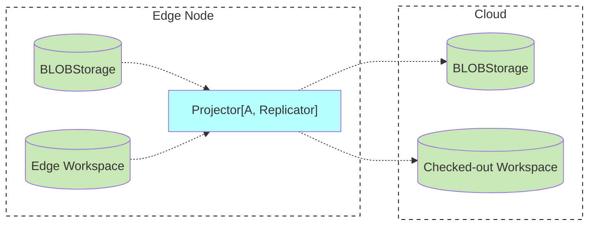

### Edge Authentication

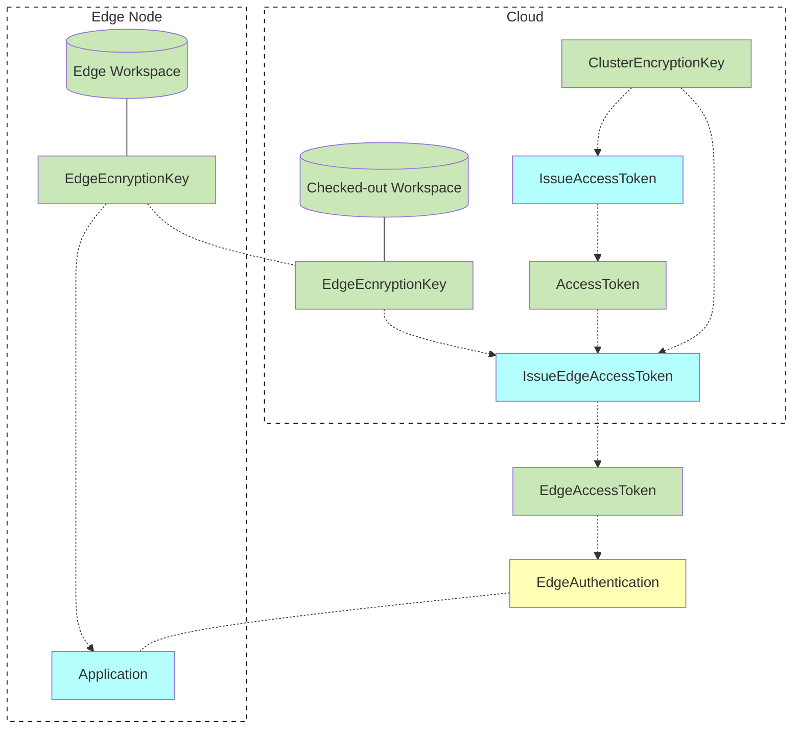

### sys_WorkspaceDescriptor_cdoc

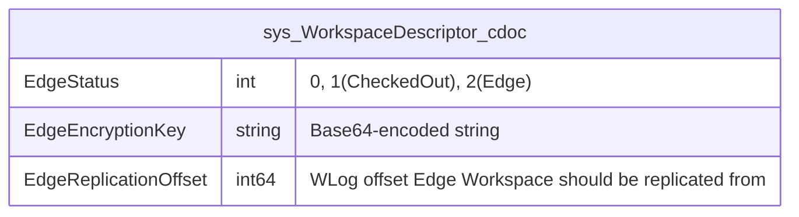

### Synced Events

```go
type IAbsractEvent struct {
    Synced()  bool
}
```

## Use cases

### Check-out Workspace

#### Get tokens

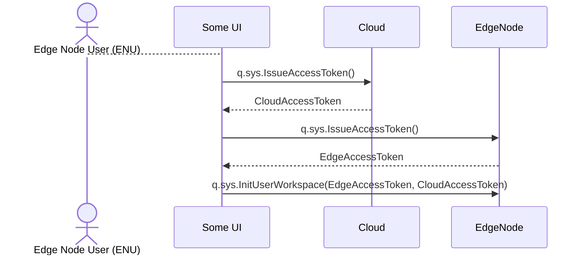

#### Check-out

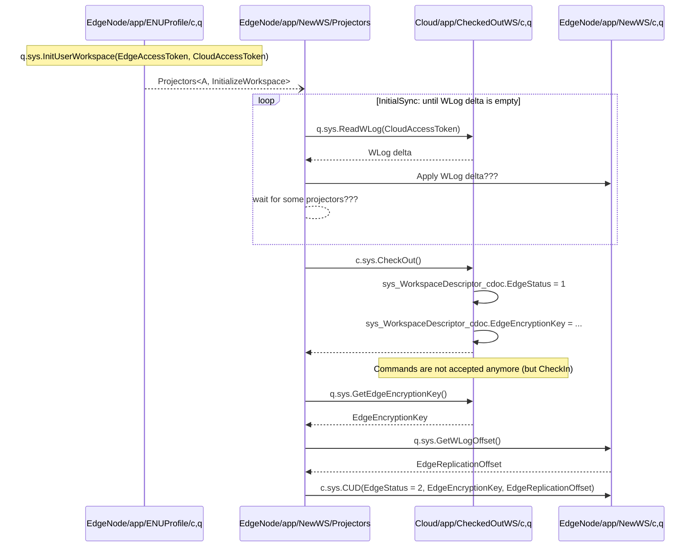

### Actualize External Projection

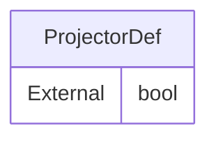
- Like Mailer

Requirements
- Skip Synced Events in External Projectors
  - if Event.Synced() == true


### Replicate Edge Workspace

Requirements
- Resulting Events in Checked-out Workspace must be Synced Events

### Initial Sync

Requirements
- Resulting Events in Edge Workspace must be Synced Events

### Process commands

Requirements
- Error if EdgeStatus == CheckedOut

## ???

- User access Edge using browser which do not have a token yet
- Edge User wants to link New device to the workspace