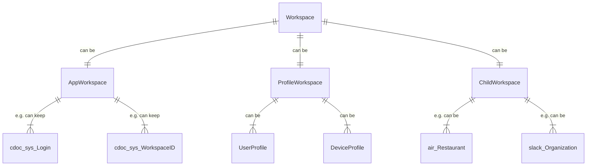
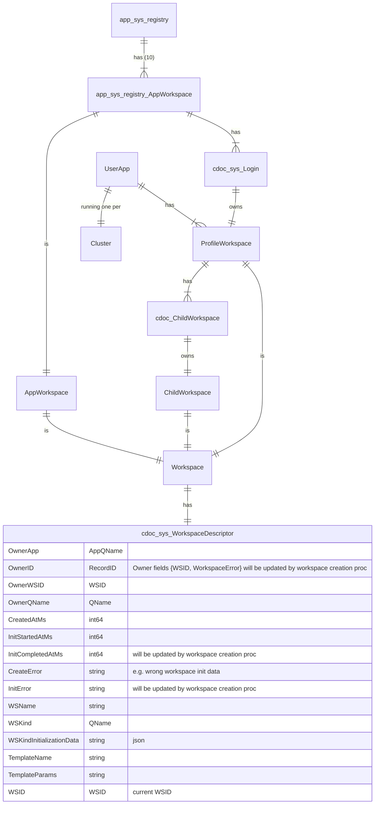
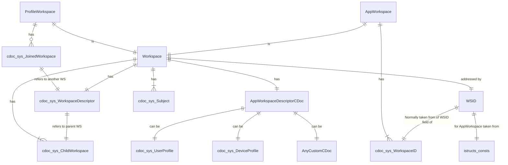
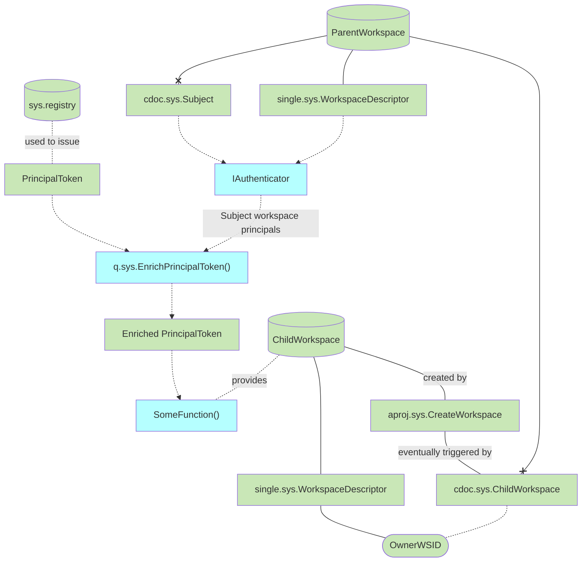

# Workspaces

## Principles

- Workspace can be AppWorkspace, ProfileWorkspace or ChildWorkspace
- Number of AppWorkspaces is fixed during application deployment and can not be changed
- ProfileWorkspace keeps Subject data, including list of ChildWorkspace-s
  - `sys.UserProfile`, `sys.DeviceProfile`
- ChildWorkspace: `air.Restaurant` etc.
  - ChildWorkspace keeps list of other ChildWorkspaces  
- Workspace has the OwningDocument
- OwningDocument: a document whose fields {WSID, wsError} will be updated when workspace will be ready
- Currently, OwningDocument kinds: `cdoc.registry.Login`, `cdoc.sys.ChildWorkspace`
- // TODO: Clearing the owner.error causes the workspace to be regenerated
- OwningDocument.error must NOT be published to CUD function (only System can update)

## Concepts

### Workspace Kinds

| English     | Russian     |
| ----------- | ----------- |
| Workspace| Рабочая область       |
| App Workspace   |Рабочая область приложения|
| Profile Workspace   | Профиль        |
| Child Workspace (can be also called `User Workspace`)   |Дочерняя рабочая область|

### Owning Document

> "Doc from App owns Workspace" means that
Workspace.Docs[sys.WorkspaceDescriptor].OwnerID = Doc.ID AND Workspace.Docs[sys.WorkspaceDescriptor].App = Doc.App

### Workspace-related tables

### Child Workspaces

