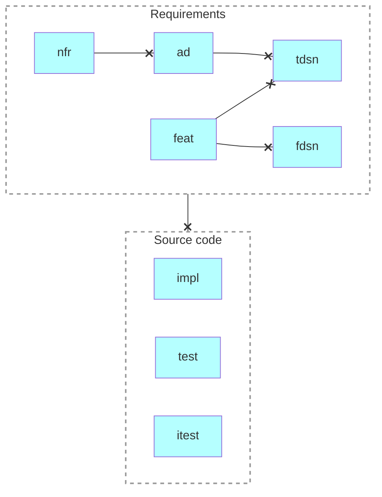

# Requirements Management

Requirements tracing using [OpenFastTrace (OFT)](https://github.com/itsallcode/openfasttrace/blob/main/doc/user_guide.md).

## Prerequisites

- bash
- Java 17.0+

## Use

- cd reqman
- bash ./trace.sh
- open .work/report.html

### Artifact types

Requirements
- `nfr`: Non-functional Requirement
- `ad`: Architectural Decision
- `tdsn`: Technical Design
- `fdsn`: Functional Design
- `feat`: Feature

Source Code
    - `impl`: Implementation
    - `test`: Unit Test
    - `itest`: Integration Test

## History

- [adsn, story...]https://github.com/voedger/voedger-internals/blob/4379075396a1fd50275c7eaf7877eb1cb23ab265/reqman/README.md#L26