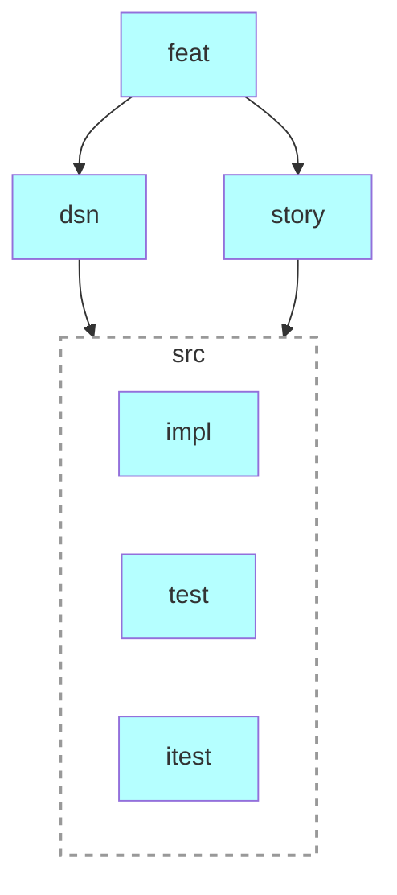

# Requirements Management

Requirements tracing using [OpenFastTrace (OFT)](https://github.com/itsallcode/openfasttrace/blob/main/doc/user_guide.md).

## Prerequisites

- bash
- Java 17.0+

## Use

- cd reqman
- bash ./trace.sh
- open .work/report.html

### Artifact types

