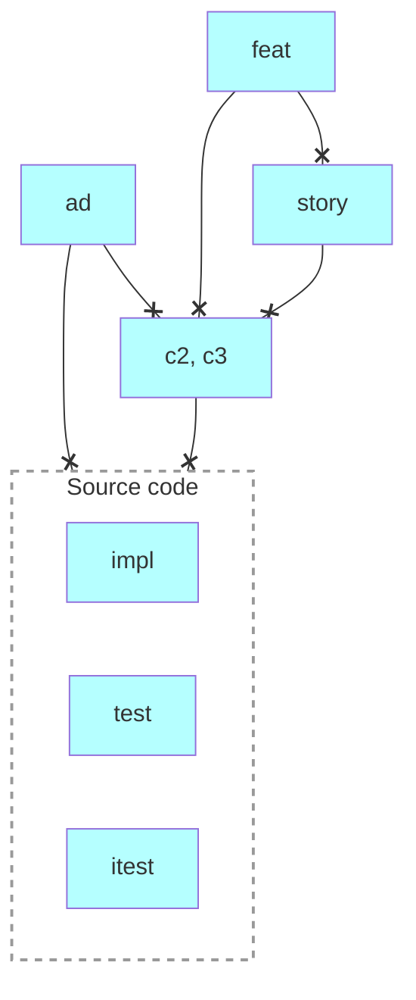

# Requirements Management

Requirements tracing using [OpenFastTrace (OFT)](https://github.com/itsallcode/openfasttrace/blob/main/doc/user_guide.md).

## Prerequisites

- bash
- Java 17.0+

## Use

- cd reqman
- bash ./trace.sh
- open .work/report.html

### Artifact types

- `ad`: Architectural Decision
- `feat`: Feature
- `story`: User Story
- `c2, c3`: [C2-](https://c4model.com/diagrams/container), [C3-level](https://c4model.com/diagrams/component) requirements (ref. [The C4 model for visualising software architecture](https://c4model.com/)).
- Source Code
    - `impl`: Implementation
    - `test`: Unit Test
    - `itest`: Integration Test

