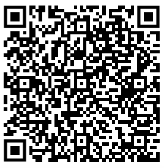

# Temporary BLOB Storage and Access: A Technical Analysis

**Author**: Maxim Geraskin  
**Copyright**: © 2024–present unTill Software Development Group B. V. All rights reserved.

## Problem Statement

We need to determine the best method for generating unique identifiers to access temporary BLOBs securely. The identifiers will be used in QR codes for easy scanning and access.

## Concerns

- **QR Code Density**: The size and complexity of the QR code generated to represent the BLOB identifier can affect scan reliability and user experience.

## Goals

- **Study Existing Approaches**: Examine current methods for generating unique identifiers and their implications on security and usability.
- **Suggest Solutions**: Propose a method that balances uniqueness, security, and practicality for accessing temporary BLOBs.

## Related Work

- [voedger-rsch/20241115-temp-blobs](https://github.com/voedger/voedger-rsch/tree/main/20241115-temp-blobs)

---

## Analysis of UUIDs and CSPRNGs

### UUID

A **Universally Unique Identifier** (UUID) is a 128-bit label used to uniquely identify objects in computer systems. The term **Globally Unique Identifier** (GUID) is also used, mostly in Microsoft systems. 

We are considering the use of UUIDs as defined in [RFC 4122](https://www.rfc-editor.org/rfc/rfc4122), for identifying temporary BLOBs.

#### Relevant Points from RFC 4122:

- **Security Considerations** ([Section 6](https://www.rfc-editor.org/rfc/rfc4122#section-6)):
  - **Do not assume that UUIDs are hard to guess**; they should not be used as security capabilities (identifiers whose mere possession grants access). A predictable random number source will exacerbate the situation.
- **Version 4 UUIDs** ([Section 4.4](https://www.rfc-editor.org/rfc/rfc4122#section-4.4)):
  - The version 4 UUID is generated from truly random or pseudo-random numbers.

#### Security Concerns:

- UUID generators can produce predictable sequences even when using cryptographically secure pseudorandom number generators (CSPRNGs).
- The specification does not require generators to produce entirely new random bytes for each UUID.
- Standard implementations (e.g., `Guid.NewGuid()` in Windows) may use basic random number generators, which are not cryptographically secure.
- **UUIDs should not be used for authentication tokens or security-sensitive applications**.

#### References:

- [Are GUIDs safe for one-time tokens?](https://security.stackexchange.com/questions/890/are-guids-safe-for-one-time-tokens)
- [UUID Version 4 Implementation](https://github.com/google/uuid/blob/master/version4.go)
- UUID Generation: [github.com/google/uuid](https://github.com/google/uuid)
- Cryptographically Secure Random Numbers: [pkg.go.dev/crypto/rand](https://pkg.go.dev/crypto/rand)

### GUID vs. CSPRNG

#### Definitions:

- **GUID/UUID**: A 128-bit value used for unique identification, often with certain bits reserved for version and variant information.
- **CSPRNG**: Cryptographically Secure Pseudorandom Number Generator, which produces unpredictable and secure random numbers.

#### Comparison of Uniqueness and Security:

1. **GUID (UUID Version 4)**:

   - **Structure**:
     - 128 bits in total, with specific bits reserved for version and variant.
     - Example format: `xxxxxxxx-xxxx-4xxx-yxxx-xxxxxxxxxxxx`.
   - **Uniqueness**:
     - Designed for uniqueness across systems without central coordination.
     - 122 bits of randomness due to reserved bits.
   - **Predictability**:
     - Slightly predictable due to fixed bits.
   - **Use Case**:
     - Ideal for globally unique identifiers in distributed systems.

2. **CSPRNG**:

   - **Structure**:
     - Generates purely random sequences without predefined structure.
     - Full entropy across all bits (e.g., 128 bits of randomness).
   - **Uniqueness**:
     - High, with \(2^{128}\) possible combinations for 128-bit numbers.
   - **Predictability**:
     - Highly unpredictable due to full randomness.
   - **Use Case**:
     - Suitable for cryptographic applications requiring maximum security.

#### Comparison Table:

| Feature           | GUID (UUID Version 4)            | CSPRNG                        |
|-------------------|----------------------------------|-------------------------------|
| **Entropy**       | 122 bits (due to fixed bits)     | Full (e.g., 128 bits random)  |
| **Uniqueness**    | Extremely high                   | Extremely high                |
| **Predictability**| Slightly predictable             | Highly unpredictable          |
| **Collision Risk**| Negligible                       | Negligible                    |
| **Use Case**      | Unique identifiers               | Cryptographic tokens/keys     |

#### Conclusion:

- **GUIDs** are suitable for scenarios where global uniqueness is required without additional coordination.
- **CSPRNGs** are preferable when security and unpredictability are critical.
- For applications requiring both uniqueness and security (e.g., temporary BLOB access), a combination of GUIDs and CSPRNGs may be ideal.

---

## QR Code Density Considerations

### Impact of Identifier Length on QR Codes

- **QR Code Density**: Larger or more complex identifiers result in denser QR codes.
- **User Experience**: Dense QR codes may be harder to scan, affecting usability.
- **Balance Needed**: Aim to minimize the size of the identifier while maintaining security.

### Example QR Codes

#### Using UUID:

- **Identifier**: `f12d6815-4e1e-4536-b260-80cab5d2a02d`
- **URL**: `https://subdomain.mycompany.com/qr/f12d6815-4e1e-4536-b260-80cab5d2a02d`
- **QR Code**:
  - 

#### Using Base64-Encoded 256-Bit Random Number:

- **Identifier**: `TlvrnLNSQ5C9bbsMBxmXjrfgLKTHl0CU2BV7RzUVRRg`
- **URL**: `https://subdomain.mycompany.com/qr/TlvrnLNSQ5C9bbsMBxmXjrfgLKTHl0CU2BV7RzUVRRg`
- **QR Code**:
  - 

#### Observation:

- Base64 encoding reduces the length of the identifier compared to hexadecimal representations.
- Using a 256-bit random number increases security but also increases the QR code density.

---

## Proposed Solution

### UUID+: Combining GUIDs with CSPRNGs

To achieve both uniqueness and security while keeping QR code density manageable, we propose to generate UUID+ and their text representation as follows:

- **Generate a UUID (Version 4)**: Provides global uniqueness.
- **Generate Additional Random Bytes**: Use a CSPRNG to add entropy.
- **Concatenate and Encode**: Combine the UUID and random bytes, then encode using Base64.

### Benefits:

- **Uniqueness**: Guaranteed by the UUID component.
- **Security**: Enhanced by the additional randomness from the CSPRNG.
- **QR Code Efficiency**: Base64 encoding keeps the identifier relatively short.

### Sample Implementation in Go:

```go
package main

import (
	"crypto/rand"
	"encoding/base64"
	"fmt"

	"github.com/google/uuid"
)

func main() {
    // Generate UUID (Version 4)
    uuidPart := uuid.New()

    // Generate additional random bytes (16 bytes for 128 bits)
    randomPart := make([]byte, 16)
    _, err := rand.Read(randomPart)
    if err != nil {
        panic(err)
    }

    // Concatenate UUID and random bytes
    combined := append(uuidPart[:], randomPart...)
    fmt.Printf("Combined (hex): %x\n", combined)

    // Encode to Base64 using URL-safe encoding
    encoded := base64.URLEncoding.WithPadding(base64.NoPadding).EncodeToString(combined)
    fmt.Println("Encoded (URL-safe Base64):", encoded)

    // Decode the Base64-encoded string back to bytes
    decoded, err := base64.URLEncoding.WithPadding(base64.NoPadding).DecodeString(encoded)
    if err != nil {
        panic(err)
    }

    // Optional: Print the decoded bytes in a readable format
    fmt.Printf("Decoded (hex): %x\n", decoded)
}
```

### Base64 Result Size Calculation

- Each character is used to represent 6 bits (`log2(64) = 6`). 
- Therefore 4 chars are used to represent `4 * 6 = 24 bits = 3 bytes`.
- So you need `4*(n/3)` chars to represent `n` bytes, and this needs to be rounded up to a multiple of 4, if padding is used.

It means:

- **Maximum Input Size**: 32 bytes (16 bytes UUID + 16 random bytes).
- **Encoded Size with Padding**: 44 characters.
- **Encoded Size without Padding**: 43 characters (URL-safe, no padding).

## Conclusion

UUID+ combines the uniqueness of GUIDs with the security of CSPRNGs. Encoding the result using Base64, we can:

- **Ensure Global Uniqueness**: The UUID component provides a globally unique identifier.
- **Enhance Security**: Additional random bytes make the identifier unpredictable.
- **Manage QR Code Density**: Base64 encoding keeps the identifier compact for efficient QR code generation.

This approach is suitable for securely accessing temporary BLOBs while maintaining a balance between security, uniqueness, and usability.

### References

