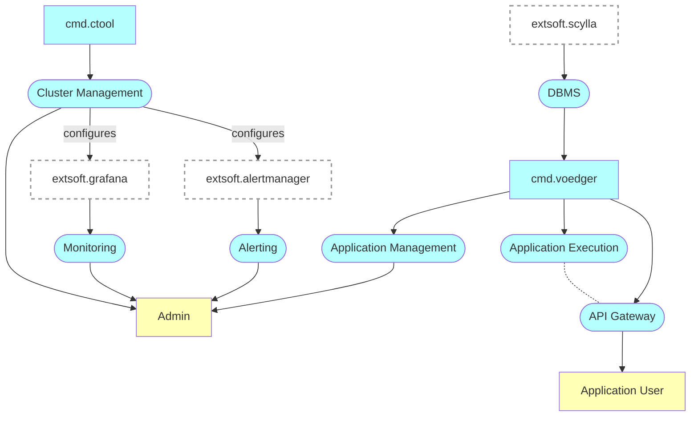

# Voedger Server

Prefixes
- *cmd*: command line utility
- *mod*: Go module
- *pkg*: Go package
- *extsoft*: external software

## Documentation structure

Documentation is organized as follows:

- Architecture folder contains the server and components architecture in C4 model notation
- Other folders contain the documentation about features and use cases