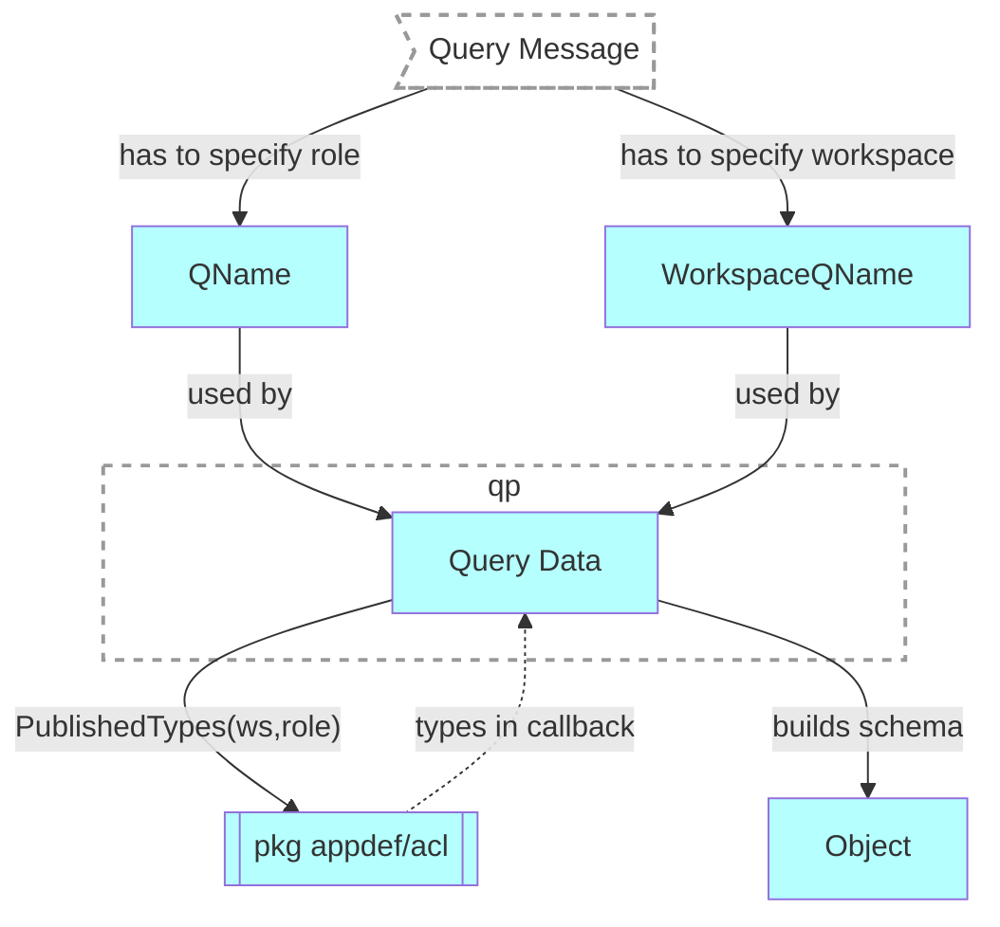

# Get workspace role schema
## Motivation
Return the schema of the resources, available to specified [published role](../authnz/published-roles.md) in a given workspace.

## Functional Design
GET `/api/v2/users/{owner}/apps/{app}/schemas/{pkg}.{workspace}/roles/{pkg}.{role}`

### Headers
| Key | Value | Description |
| --- | --- | --- |
| Accept | application/json | To get the response in OpenAPI format (default) |

### Result
| Code | Description | Body |
| --- | --- | --- |
| 200 | OK | role schema in the selected format |
| 400 | Bad Request | [error object](conventions.md#errors) |

## Technical Design
- WorkspaceQName and QName of the role are provided to QPv2 in [QueryMessage](../design/qp.md#qpMessage)
- QPv2 reads the schema of the resources available to the role and returns it in the OpenAPI format

### PublishedTypes
```go
package acl

/*
    PublishedTypes lists the resources allowed to the published role in the workspace and ancestors (including resources available to non-authenticated requests):
    - Documents
    - Views
    - Commands
    - Queries

    When fieldNames is empty, it means all fields are allowed

*/
func PublishedTypes(ws appdef.IWorkspace, role appdef.QName) iter.Seq2[appdef.IType,
  iter.Seq2[appdef.OperationKind, *[]appdef.FieldName]]
```

Usage:
```go
import "github.com/voedger/voedger/pkg/appdef/acl"

for t, ops := range acl.PublishedTypes(ws, role) {
  for op, fields := range ops {
    if fields == nil {
      fmt.Println(t, op, "all fields")
    } else {
      fmt.Println(t, op, *fields...)
    }
  }
}
```

## See Also
- [design: QPv2](../design/qp.md#query-processor-v2-apiv2)
- [List workspace roles](list-ws-roles.md)
- [List app workspaces](list-app-workspaces.md)
