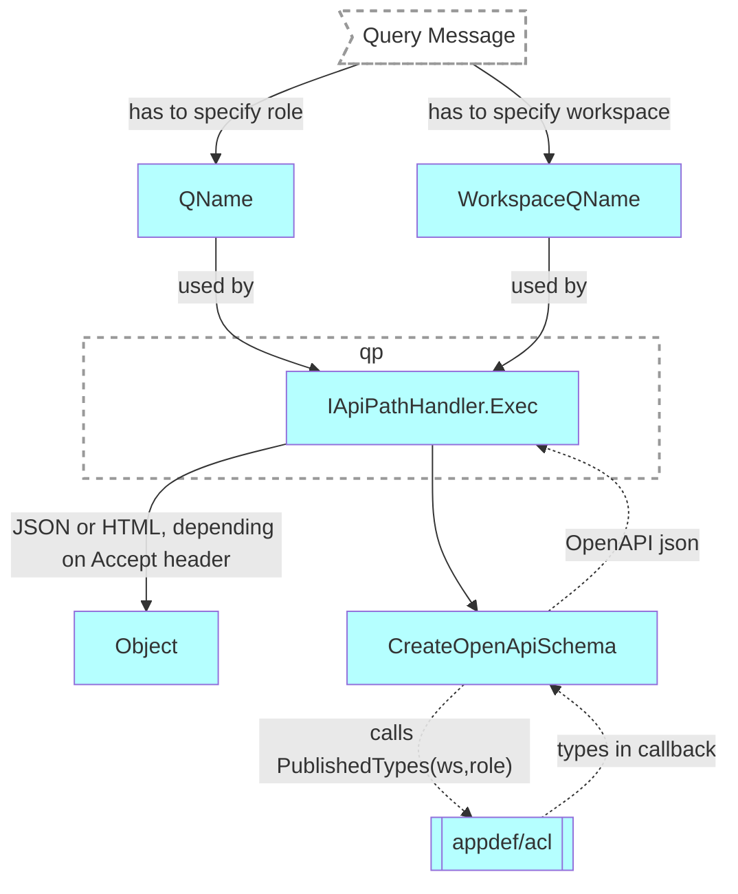

# Get workspace role schema

## Motivation

Return the schema of the resources, available to specified role in a given workspace.

## Functional Design

GET `/api/v2/apps/{owner}/{app}/schemas/{pkg}.{workspace}/roles/{pkg}.{role}`

If [non-published role](../authnz/published-roles.md) is specified, the user must have `sys.Developer` role in the workspace to see the schema.

### Headers

| Key | Value | Description |
| --- | --- | --- |
| Authorization | Bearer {PrincipalToken} | optional |
| Accept | application/json | To get the response in OpenAPI format (default) |
| Accept | text/html | Shows schema in Swagger UI |

### Parameters

| Parameter | Type | Description |
| --- | --- | --- |
| owner | string | name of a user who owns the application |
| app | string | name of an application |
| pkg.workspace | string | identifies a workspace |
| pkg.role | string | identifies a published role |

### Result

| Code | Description | Body |
| --- | --- | --- |
| 200 | OK | role schema in the selected format |
| 400 | Bad Request | [error object](errors.md) |

## Technical Design

- WorkspaceQName and QName of the role are provided to QPv2 in [QueryMessage](../design/qp.md#qpMessage)
- QPv2 reads the schema of the resources available to the role and generates OpenAPI schema for this role



### Components

#### pkg/appdef/acl

New function `PublishedTypes` `~cmp.publishedTypes~`covrd[^1]✅

```go
/*
    PublishedTypes lists the resources allowed to the published role in the workspace and ancestors (including resources available to non-authenticated requests):
    - Documents
    - Views
    - Commands
    - Queries

    When fieldNames is empty, it means all fields are allowed
*/
func PublishedTypes(ws appdef.IWorkspace, role appdef.QName) iter.Seq2[appdef.IType,
  iter.Seq2[appdef.OperationKind, *[]appdef.FieldName]] {
…
}
```

Usage:

```go
import "github.com/voedger/voedger/pkg/appdef/acl"

for t, ops := range acl.PublishedTypes(ws, role) {
  for op, fields := range ops {
    if fields == nil {
      fmt.Println(t, op, "all fields")
    } else {
      fmt.Println(t, op, *fields...)
    }
  }
}
```

#### pkg/processors/query2

##### 1. `IApiPathHandler` implementation for handling `ApiPath_Schemas_WorkspaceRole`

`~cmp.schemasRoleHandler~`covrd[^2]✅

##### 2. `newQueryProcessorPipeline`: provide API handler for `ApiPath_Schemas_WorkspaceRole`

`~cmp.provideSchemasRoleHandler~`covrd[^3]✅

##### 3. New function `CreateOpenApiSchema`

```go
type SchemaMeta struct {
    schemaTitle string
    schemaVerstion string
}

type PublishedTypesFunc func(ws appdef.IWorkspace, role appdef.QName) iter.Seq2[appdef.IType,
  iter.Seq2[appdef.OperationKind, *[]appdef.FieldName]]

func CreateOpenApiSchema(writer io.Wrter, ws appdef.IWorkspace, role appdef.QName, 
      pubTypesFunc PublishedTypesFunc, meta SchemaMeta) error
```

`~cmp.CreateOpenApiSchema~`covrd[^4]✅

##### 4. pkg/sys/it

integration test `~it.TestQueryProcessor2_SchemasRole~`covrd[^5]✅

## See Also

- [design: QPv2](../design/qp.md#query-processor-v2-apiv2)
- [List workspace roles](list-ws-roles.md)
- [List app workspaces](list-app-workspaces.md)

[^1]: `[~server.apiv2.role/cmp.publishedTypes~impl]` [pkg/appdef/acl/provide.go:92:impl](https://github.com/voedger/voedger/blob/main/pkg/appdef/acl/provide.go#L92), [pkg/appdef/acl/provide_test.go:851:test](https://github.com/voedger/voedger/blob/main/pkg/appdef/acl/provide_test.go#L851)
[^2]: `[~server.apiv2.role/cmp.schemasRoleHandler~impl]` [pkg/processors/query2/impl_schemas_role_handler.go:24:impl](https://github.com/voedger/voedger/blob/main/pkg/processors/query2/impl_schemas_role_handler.go#L24)
[^3]: `[~server.apiv2.role/cmp.provideSchemasRoleHandler~impl]` [pkg/processors/query2/impl.go:136:impl](https://github.com/voedger/voedger/blob/main/pkg/processors/query2/impl.go#L136)
[^4]: `[~server.apiv2.role/cmp.CreateOpenApiSchema~impl]` [pkg/processors/query2/impl_openapi.go:19:impl](https://github.com/voedger/voedger/blob/main/pkg/processors/query2/impl_openapi.go#L19)
[^5]: `[~server.apiv2.role/it.TestQueryProcessor2_SchemasRole~impl]` [pkg/sys/it/impl_qpv2_test.go:2038:impl](https://github.com/voedger/voedger/blob/main/pkg/sys/it/impl_qpv2_test.go#L2038)
