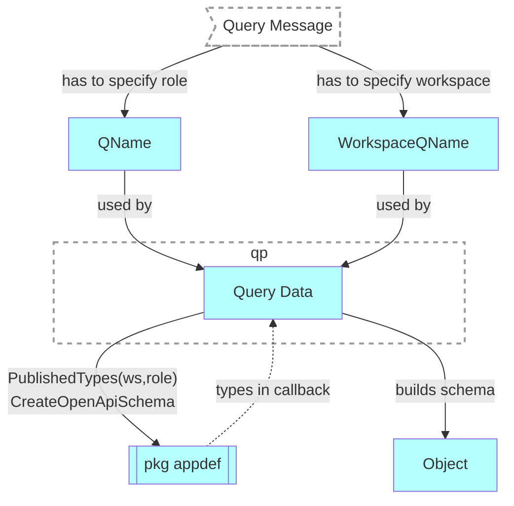

# Get workspace role schema
## Motivation
Return the schema of the resources, available to specified [published role](../authnz/published-roles.md) in a given workspace.

## Functional Design
GET `/api/v2/users/{owner}/apps/{app}/schemas/{pkg}.{workspace}/roles/{pkg}.{role}`

### Headers
| Key | Value | Description |
| --- | --- | --- |
| Accept | application/json | To get the response in OpenAPI format (default) |
| Accept | text/html | Shows schema in Swagger UI |

### Parameters
| Parameter | Type | Description |
| --- | --- | --- |
| owner | string | name of a user who owns the application |
| app | string | name of an application |
| pkg.workspace | string | identifies a workspace |
| pkg.role | string | identifies a published role |

### Result
| Code | Description | Body |
| --- | --- | --- |
| 200 | OK | role schema in the selected format |
| 400 | Bad Request | [error object](conventions.md#errors) |

## Technical Design
- WorkspaceQName and QName of the role are provided to QPv2 in [QueryMessage](../design/qp.md#qpMessage)
- QPv2 reads the schema of the resources available to the role and returns it in the OpenAPI format

### Components
- [PublishedTypes - list published role resources](https://github.com/voedger/voedger/issues/3337)
- [CreateOpenApiSchema - generate OpenApi for a workspace published](https://github.com/voedger/voedger/issues/3423)

## See Also
- [design: QPv2](../design/qp.md#query-processor-v2-apiv2)
- [List workspace roles](list-ws-roles.md)
- [List app workspaces](list-app-workspaces.md)
