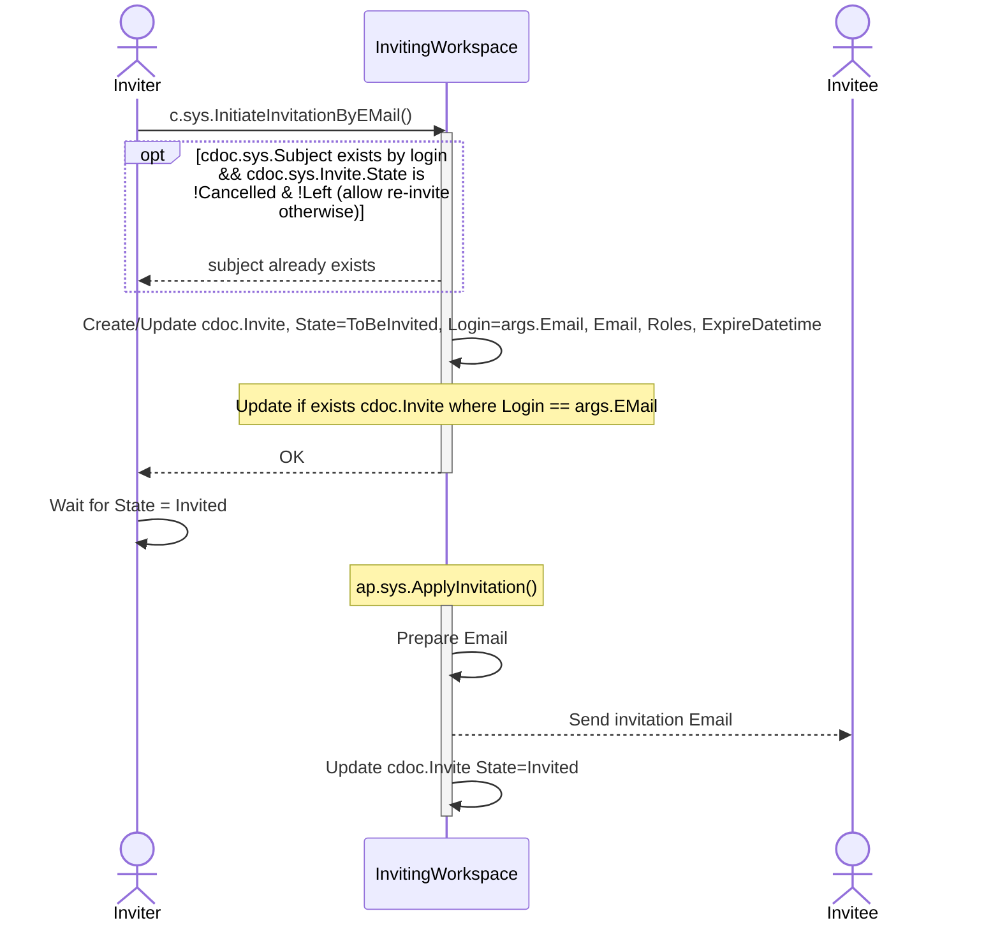
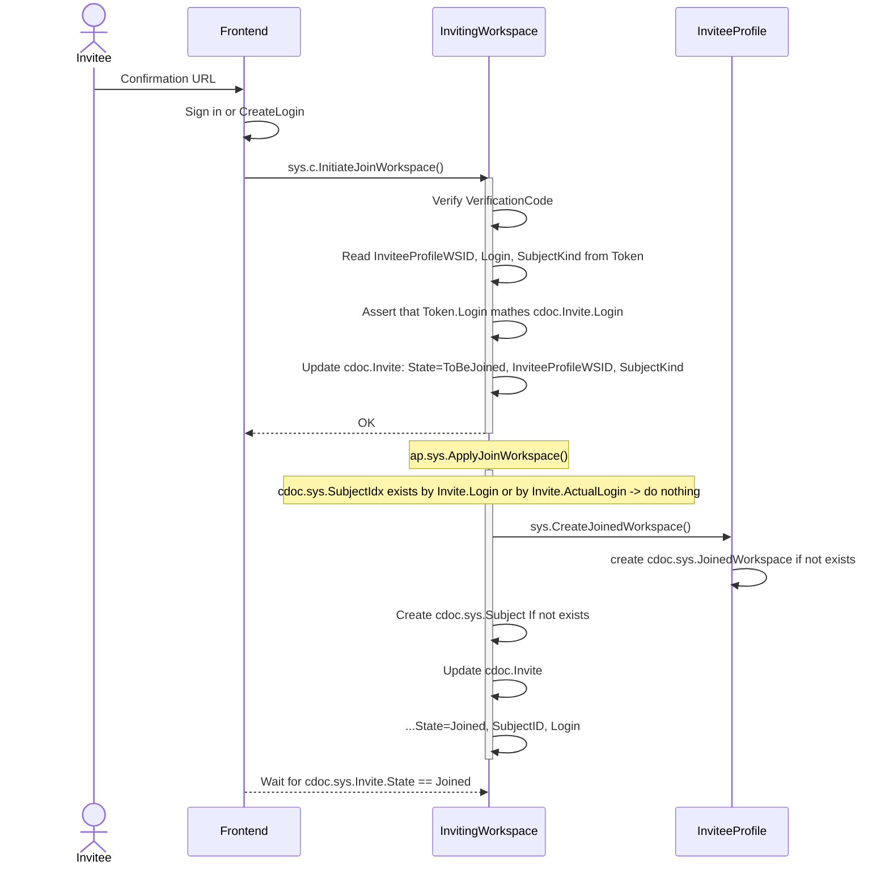
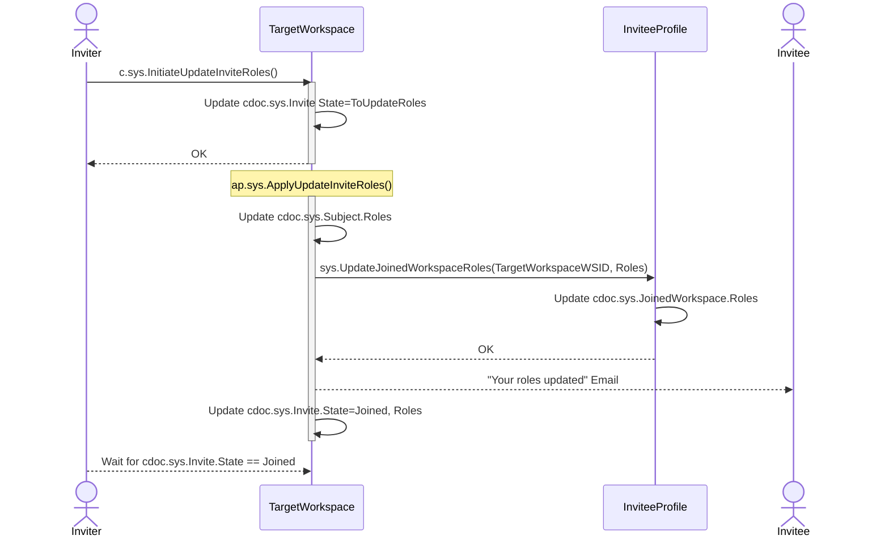
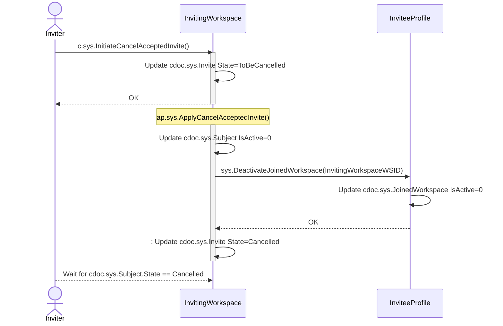
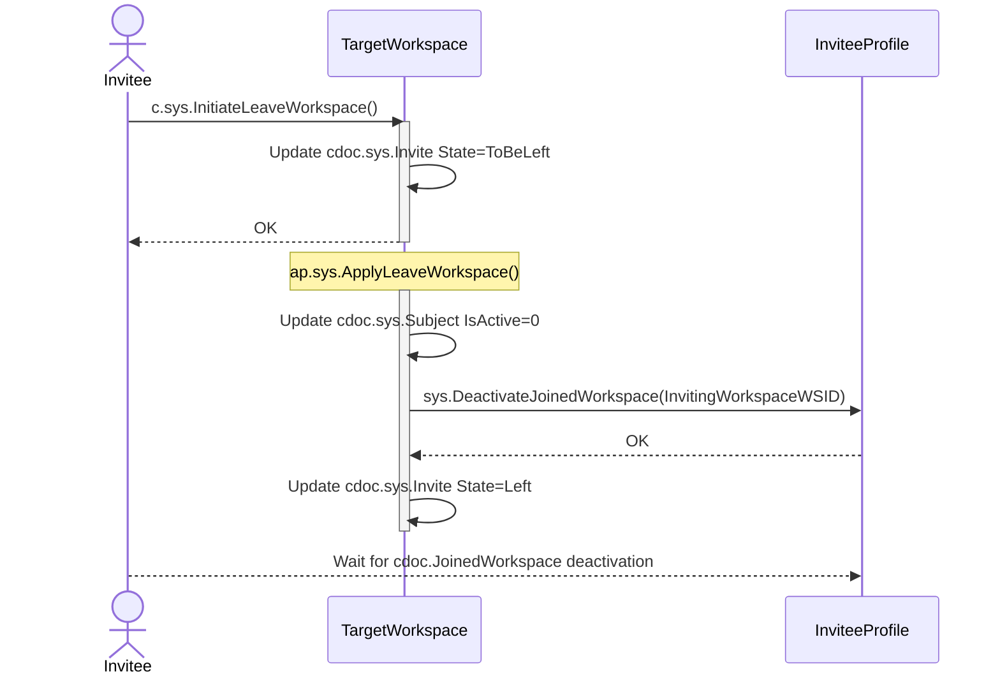
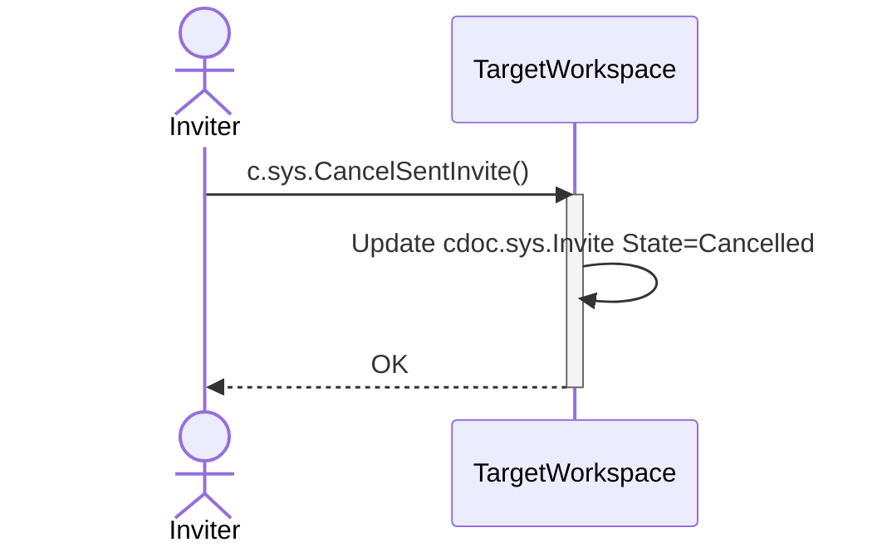

# Invite functionality

## Table of contents

Commands
- [c.sys.InitiateInvitationByEMail()](#csysinitiateinvitationbyemail)
- [c.sys.InitiateJoinWorkspace()](#csysinitiatejoinworkspace)
- [c.sys.InitiateUpdateInviteRoles()](#csysinitiateupdateinviteroles)
- [c.sys.InitiateCancelAcceptedInvite()](#csysinitiatecancelacceptedinvite)
- [c.sys.InitiateLeaveWorkspace()](#csysinitiateleaveworkspace)
- [c.sys.CancelSentInvite()](#csyscancelsentinvite)

Docs
- [cdoc.sys.Invite](#cdocsysinvite)
- [cdoc.sys.Subject](#cdocsyssubject)

## c.sys.InitiateInvitationByEMail()

- AuthZ: role.sys.WorkspaceAdmin
- Params
    - Email
    - Roles
    - ExpireDatetime
    - EmailTemplate // Must be prefixed with 'text:' or 'resource:'
        - Placeholders:
            - ${VerificationCode}
            - ${InviteID}
            - ${WSID} - Inviting Workspace ID
            - ${WSName} - Inviting Workspace Name
            - ${Email} - Invitee Email
    - EmailSubject
- Errors
    - State not in (None, Cancelled, Left, Invited)
    - invalid argument EmailTemplate
- //TODO: EMail => Login must be implemented, currently it is supposed that EMail == Login

**Behavior:**

## cdoc.sys.Invite

- ID
- SubjectKind ([User/Device](https://github.com/heeus/core-istructs/blob/b95ff00ea97f3731f58b8d95f71914f29786e6bf/types.go#L81))
- Login // actually `c.sys.InitiateInvitationByEmail.EMail`
- Email // actually `c.sys.InitiateInvitationByEmail.EMail`
- Roles (comma-separated)
- ExpireDatetime (unix-timestamp)
- VerificationCode
- State
- Created (unix-timestamp) ???
- Updated (unix-timestamp) ???
- SubjectID (Subject.ID) // by ap.sys.ApplyJoinWorkspace
- InviteeProfileWSID     // by ap.sys.ApplyJoinWorkspace
- ActualLogin            // `token.Login`, by ap.sys.ApplyJoinWorkspace

## c.sys.InitiateJoinWorkspace()

- AuthZ: PrincipalToken + VerificationCode
- Params
  - InviteID
  - VerificationCode
- Errors
  - Invite state is not in (Invited)
  - Invite does not exist
  - Invite expired
  - token login does not match invite login
  - wrong Verification Code

**Behavior:**

## cdoc.sys.Subject

- Login // old stored records -> `Invite.Login` that is actually `c.sys.InitiateInvitationByEMail.Email`, new records (starting from https://github.com/voedger/voedger/issues/1107) - `Invite.ActualLogin` that is login from token
- SubjectKind ([User/Device](https://github.com/heeus/core-istructs/blob/b95ff00ea97f3731f58b8d95f71914f29786e6bf/types.go#L81))
- Roles (comma-separated list)

## c.sys.InitiateUpdateInviteRoles()

- AuthZ: role.sys.WorkspaceAdmin
- Params
    - InviteID
    - Roles
    - EmailTemplate // Must be prefixed with 'text:' or 'resource:'
    - EmailSubject
- Errors
    - State not in (Joined)
    - invalid argument EmailTemplate

**Behavior:**

## c.sys.InitiateCancelAcceptedInvite()

- AuthZ: role.sys.WorkspaceAdmin
- Params
    - InviteID
- Errors
    - State not in (Joined)

**Behavior:**

## c.sys.InitiateLeaveWorkspace()

- AuthZ: role.sys.Subject
- Params
    - Token.Login is used to find Invite
- Errors
    - Invite not found
    - State not in (Joined)

**Behavior:**

## c.sys.CancelSentInvite()

- AuthZ: role.sys.WorkspaceAdmin
- Params
    - InviteID
- Errors
    - State not in (Invited)

