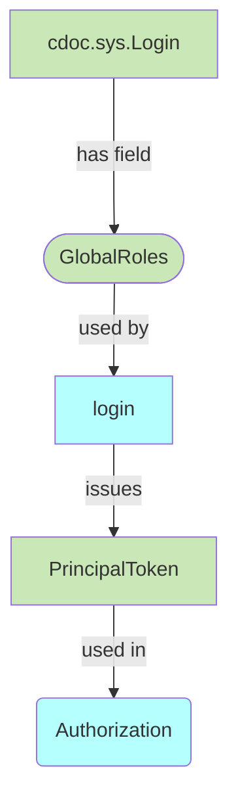
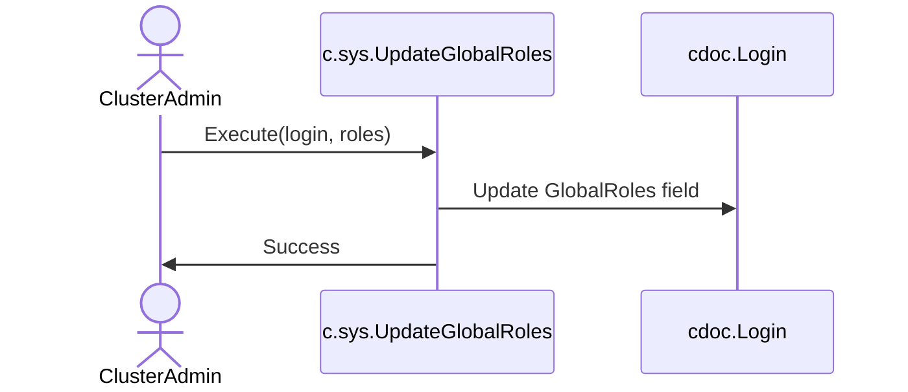

# Global Roles

## Abstract

This document outlines the design for Global Roles in the authentication and authorization system, enabling roles that apply across all workspaces.

## Motivation

- Administrators currently need to assign the same roles repeatedly in multiple workspaces
- Need for a mechanism to assign roles at the system level that apply globally
- Simplify permission management for system administrators
- Reduce the risk of permission inconsistencies across workspaces

## Introduction

**Global Role**: A system-level role assigned to users that will be included in all PrincipalTokens and participate in authorization regardless of which workspace is being accessed. This design addresses the need for consistent role assignment across the system while maintaining compatibility with the existing authorization model.

## Concepts



---

## Functional design

### ClusterAdmin: Update Global Roles


---

## Technical design

- `~cmp.c.sys.UpdateGlobalRoles~`uncvrd[^1]❓
  - AuthZ: System
- `~cmp.cdoc.registry.Login.GlobalRoles~`uncvrd[^2]❓: New field in the `Login` table

```sql
ALTER WORKSPACE sys.AppWorkspaceWS (
    TABLE Login INHERITS sys.CDoc (
        -- ... existing fields ...
        GlobalRoles varchar(1024)    -- Comma-separated list of global roles
    );
);
```

- `~tuc.UseGlobalRolesInAuthz~`uncvrd[^3]❓

[^1]: `[~server.authnz.groles/cmp.c.sys.UpdateGlobalRoles~impl]`
[^2]: `[~server.authnz.groles/cmp.cdoc.registry.Login.GlobalRoles~impl]`
[^3]: `[~server.authnz.groles/tuc.UseGlobalRolesInAuthz~impl]`
