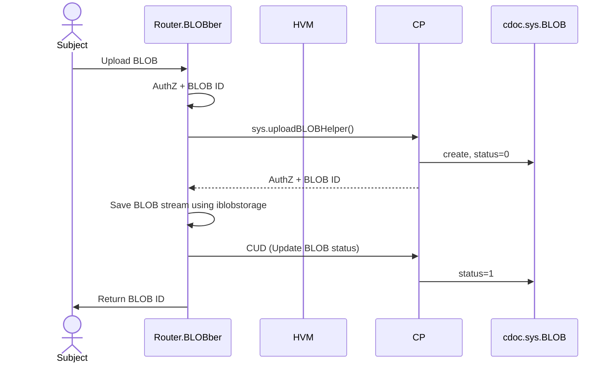

# BLOBs

## Upload BLOB

**POST**
- url: `<federation-domain>/blob/<app-name>/<wsid>`
  - `alpha.dev.untill.com/blob/untill/airs-bp/127889070`
  - PrincipalToken: header `Authorization`: Bearer `<PrincipalToken>`

See also.
- [https://security.stackexchange.com/questions/108662/why-is-bearer-required-before-the-token-in-authorization-header-in-a-http-re](https://security.stackexchange.com/questions/108662/why-is-bearer-required-before-the-token-in-authorization-header-in-a-http-re)

## Download BLOB

**GET**
- url: `<federation-domain>/blob/<app-name>/<wsid>/<blobid>`
  - PrincipalToken: cookies/header `Authorization`: Bearer `<PrincipalToken>`

## Technical dept

- It is unclear how to AuthZ by blobID

## Related work

- [Design: BLOBs](https://dev.untill.com/launchpad/#!12652)

