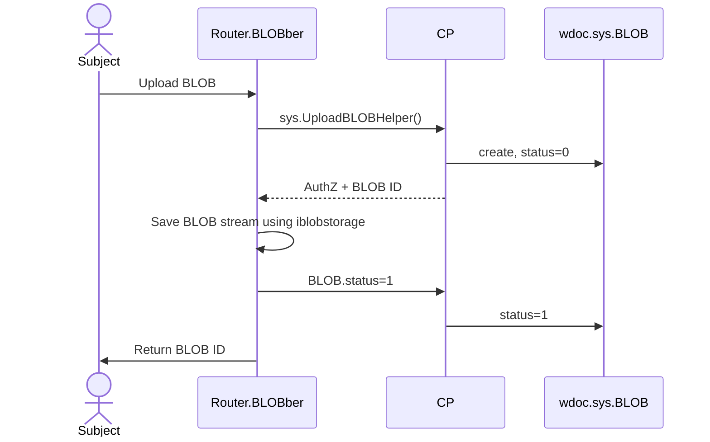
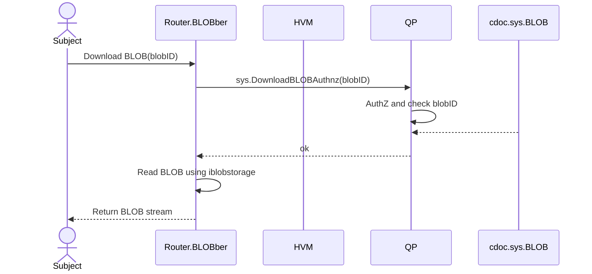

# BLOBs

## Upload BLOB

**POST**
- url: `<federation-domain>/blob/<app-name>/<wsid>`
  - `alpha.dev.mycompany.com/blob/mycompany/airs-bp/127889070?name=blob&mimeType=text/plain`
  - PrincipalToken: header `Authorization`: Bearer `<PrincipalToken>`

## Download BLOB

**GET**
- url: `<federation-domain>/blob/<app-name>/<wsid>/<blobid>`
  - PrincipalToken: cookies/header `Authorization`: Bearer `<PrincipalToken>`

## Technical dept

- It is unclear how to AuthZ by blobID

## Related work

- [stackexchange.com: Why is 'Bearer' required before the token in 'Authorization' header in a HTTP request?](https://security.stackexchange.com/questions/108662/why-is-bearer-required-before-the-token-in-authorization-header-in-a-http-re)

### launchpad #!12652

