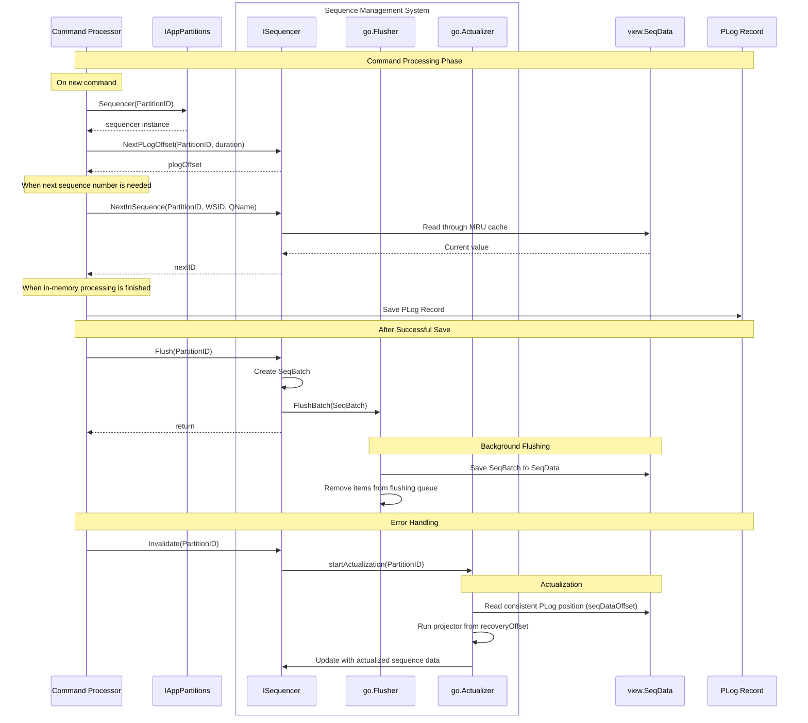

# Sequences

This document outlines the design for sequence number management within the Voedger platform.

## Overview

A **Sequence** in Voedger is defined as a monotonically increasing series of numbers. The platform provides a unified mechanism for sequence generation that ensures reliable, ordered number production.

Currently, Voedger implements four specific sequence types using this mechanism:

- **PLogOffsetSequence**: Tracks write positions in the PLog
- **WLogOffsetSequence**: Manages offsets in the WLog
- **CRecordIDSequence**: Generates unique identifiers for CRecords
- **OWRecordIDSequence**: Provides sequential IDs for O/W- Records

While the underlying generation mechanism remains consistent across all sequences, each type serves a distinct purpose within the platform's architecture. As Voedger evolves, this foundation will support additional sequences types, including custom sequences defined by applications themselves.

As the Voedger platform evolves, the number of sequence types is expected to expand. Future development will enable applications to define their own custom sequence types, extending the platform's flexibility to meet diverse business requirements beyond the initially implemented system sequences.

These sequences ensure consistent ordering of operations, proper transaction management, and unique identification across the platform's distributed architecture. The design prioritizes performance and scalability by implementing an efficient caching strategy and background updates that minimize memory usage and recovery time.

Each application partition maintains its sequence data in a dedicated projection (**SeqData**), accessed through an MRU (Most Recently Used) cache to optimize memory utilization while maintaining high throughput. The implementation addresses previous limitations around memory consumption and startup recovery time, making Voedger more efficient for large-scale deployments with numerous workspaces.

## Motivation

The current sequence implementation has several critical limitations that impact system performance and scalability:

- **Excessive Memory Consumption**: Sequence data for all workspaces is loaded into memory simultaneously, creating a direct correlation between memory usage and the number of workspaces. This approach becomes unsustainable as applications scale.

- **Prolonged Startup Times**: During command processor initialization, a resource-intensive "recovery process" must read and process the entire PLog to determine the last used sequence numbers. This causes significant startup delays that worsen as event volume grows.

- **Limited Scalability**: The combination of high memory overhead and lengthy recovery times creates a ceiling on practical deployment size, constraining the platform's ability to handle very large installations.

These limitations create two primary challenges that must be addressed:

1. **Unbound Memory Growth**: Memory usage that scales linearly with workspace count becomes prohibitive in large installations.

2. **Startup Performance Bottleneck**: Recovery times that scale with PLog size create unacceptable delays during system initialization or recovery scenarios.

The proposed redesign tackles these issues through intelligent caching, background updates, and optimized storage mechanisms that maintain sequence integrity while dramatically improving resource utilization and responsiveness.

## Solution overview

The proposed approach implements a more efficient and scalable sequence management system through the following key components:

- **Projection-Based Storage**: Each application partition will maintain sequence data in a dedicated projection (`SeqData`), eliminating the need to load all sequence data into memory at once.

- **Offset Tracking**: `SeqData` will include a `SeqDataOffset` attribute that indicates the PLog partition offset for which the stored sequence data is valid, enabling precise recovery and synchronization.

- **MRU Cache Implementation**: Sequence data will be accessed through a Most Recently Used (MRU) cache that prioritizes frequently accessed sequences while allowing less active ones to be evicted from memory.

- **Background Updates**: As new events are written to the PLog, sequence data will be updated in the background, ensuring that the system maintains current sequence values without blocking operations.

- **Batched Writes**: Sequence updates will be collected and written in batches to reduce I/O operations and improve throughput.

- **Optimized Actualization**: The actualization process will use the stored `SeqDataOffset` to only process events since the last known valid state, dramatically reducing startup times.

This approach decouples memory usage from the total number of workspaces and transforms the recovery process from a linear operation dependent on total event count to one that only needs to process recent events since the last checkpoint.

## Related issues

This document addresses the following issues:

- [Sequences #3215](https://github.com/voedger/voedger/issues/3215)

## Architecture

## Use cases

### Structs

- IDBatch
  - PLogOffset
  - `map[{WSID, QName}, istructs.RecordID]`

### NextPLogOffset(PartitionID, duration) Offset

- Actor: CP
- When: CP needs to process a request
- Flow:
  - `Status[PartitionID] == Clean && !IsRecoveryRunning(PartitionID)`):
    - Set `Status[PartitionID]` to `InProcess`
    - Return NextPLogOffset
  - `IsRecoveryRunning(PartitionID)`:
    - Wait for duration
    - If wait fails, return 0
    - Repeat Flow
  - `Status[PartitionID] == InProcess`: panic

### NextInSequence(PartitionID, WSID, QName) ID

- Actor: CP
- When: CP needs the next number in a sequence.
- Flow:
  - `Status[PartitionID] == InProcess`:
    - Generate the next ID. Read IDView (using reader) through (LRU cache + flushing queue).
  - panic

### Flush(PartitionID) IDBatch

- Actor: CP
- When: After CP saves the PLog record successfully
- Flow
  - Fails if there are too many records to flush
  - `Status[PartitionID] == InProcess`:
    - Include all generated IDs into IDBatch and send it to the flusher routine for FlushBatch
    - `Status[PartitionID] = Clean`
  - panic

### Invalidate(PartitionID)

- Actor: CP
- When
  - After CP fails to save the PLog record
  - After Flush() fails
- Flow:
  - `Status[PartitionID] == Dirty`:
    - ???
    - ???
  - panic
  - Flow: `startRecovery(PartitionID)`

### startRecovery(PartitionID)

- When: Partition is deployed or invalidated
- Only one routine per PartitionID is allowed
- Read recovery PLog position (recoveryOffset)
- Run projector starting from recoveryOffset
- Start rproutine

### Flusher routine

- Actor: flusher routine
- Flow:
  - Save IDBatch to IDView
  - Remove items from flushing queue

### recovery(PartitionID)

Flow:

- Should read last saved NextPLogOffset, read all events starting from this offset and update IDView

## Architecture

- pkg/isequencer
  - ISequencer
  - New(PartitionID???, reader ReadIDView, writer func(batch IDBatch), recoverer(offset, flusher func(ctx, b *IDBatch))) ISenquencer
    - Instantiated by appparts.AppPartitions when new partition is deployed
    - writer is used by flusher
    - Immediately starts recovery in a separate routine
      - flusher()
  - sequencer: implementation of ISequencer
- appparts.AppPartitions
  - IAppPartition.Sequencer(PartitionID) ISequencer
- QNames
  - appdef/sys
