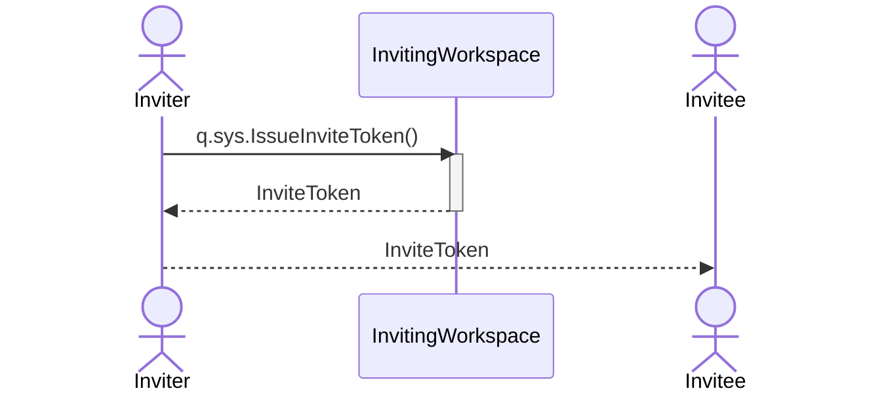
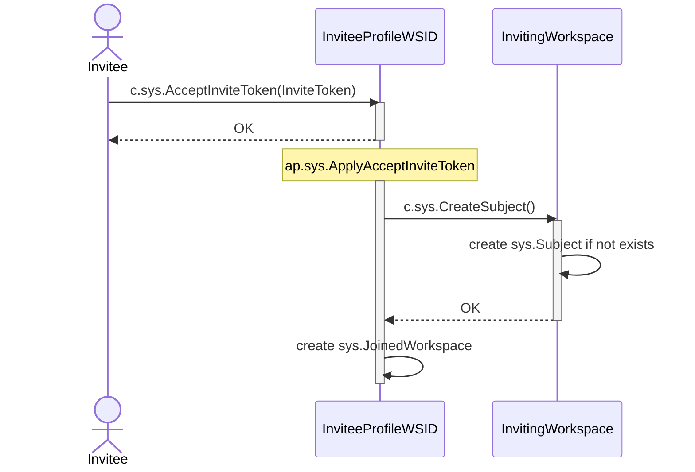

# Invite device to workspace

## Motivation

As a Workspace Owner I want to invite a [registered device](./create-device.md) to a workspace with specified roles, so that if it accepts the invitation, it can access the workspace with those roles.

## Components

- `~q.sys.Workspace.IssueInviteToken~`
- `~c.sys.Workspace.AcceptInviteToken~`
- `~ap.sys.Workspace.ApplyAcceptInviteToken~`
- `~c.sys.Workspace.CreateSubject~`

### q.sys.IssueInviteToken

- AuthNZ: `role.sys.WorkspaceAdmin`
- Params:
  - `AllowedSubjectKind int` (0-any)
  - `Roles string`
  - `ExpireDatetime timestamp`

#### Behavior

### c.sys.AcceptInviteToken

- AuthNZ: `role.sys.AuthenticatedUser` + InviteToken
- Params:
  - `InviteToken string`

