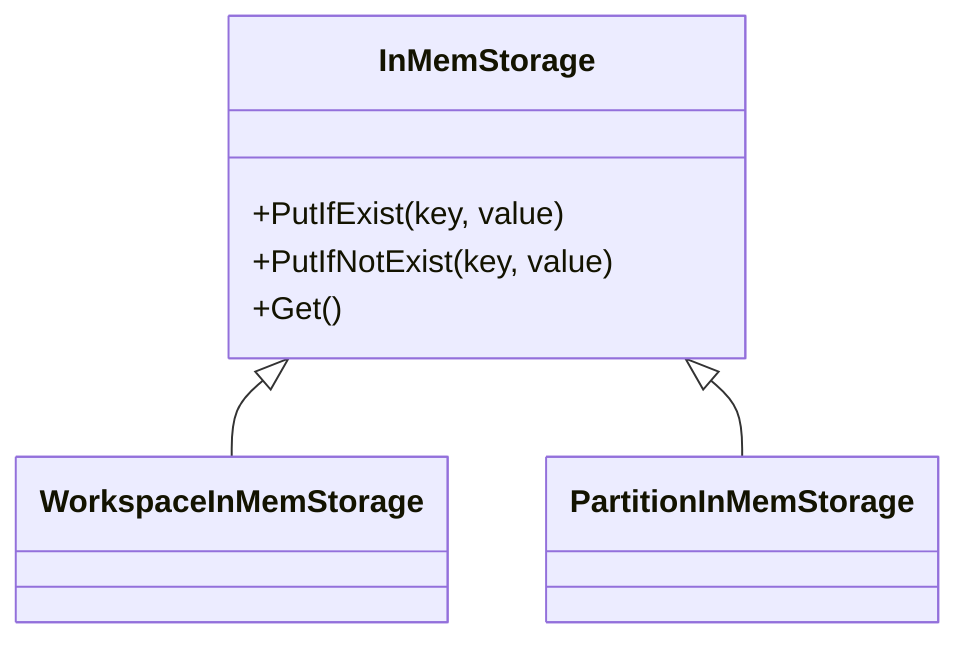
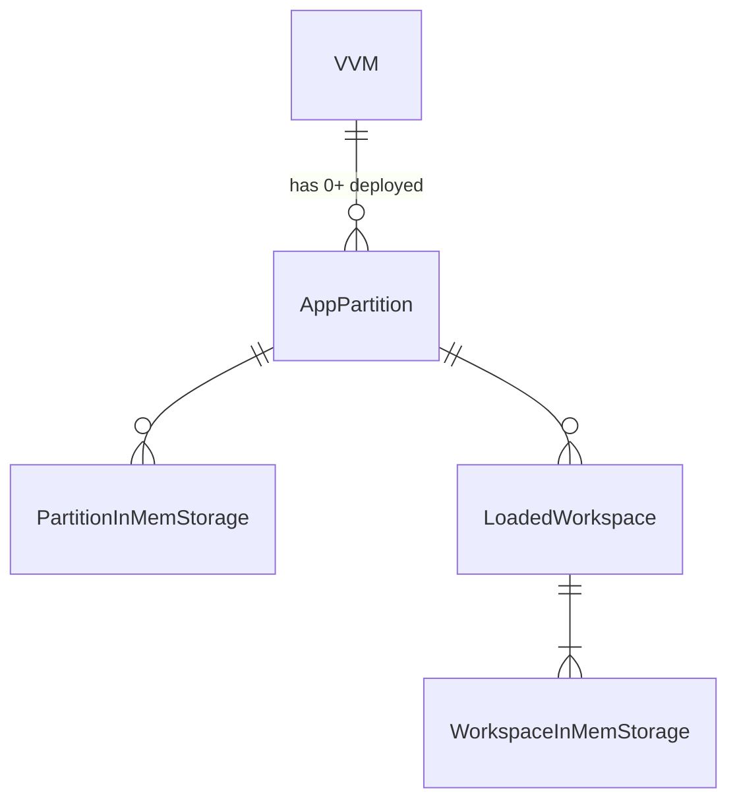

# In-Memory Storage

## Motivation

[In-Memory Storage #2269](https://github.com/voedger/voedger/issues/2269)
- 674859
- As a location owner, I want to prevent POS users from working on the same table simultaneously to avoid confusion and errors.
- We want to reduce the likelihood of such errors occurring.

## Solution

- POS device locks the table if the lock does not exist yet or the lock is expired.
- Locks ares stored in unreliable In-Memory Storage (`[WSID][tableNo]lockedAt)`).
- Can be also used to track the status of devices (`[partition][device]lastActivityAt)`).

## Functional design

- Client: sends a query???
- Query: puts/gets data to/from In-Memory Storage

## Technical design: principles

- In-Memory Storage lives until the partition is executed by the VVM
- Storage kind
  - Workspace In-Memory Storage
  - Partition In-Memory Storage
- Not logged

