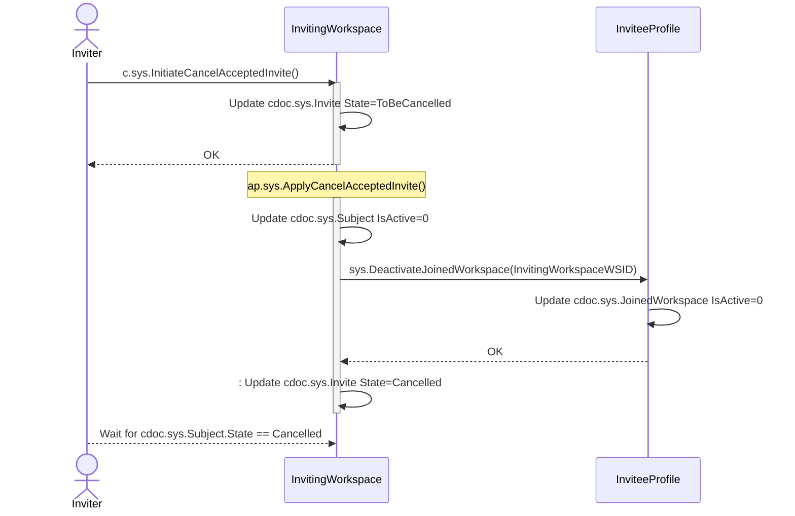

## c.sys.InitiateCancelAcceptedInvite()

- AuthZ: role.sys.WorkspaceAdmin
- Params
    - InviteID
- Errors
    - State not in (Joined)

**Behavior:**

```mermaid
sequenceDiagram

    actor inviter as Inviter
    participant workspace as InvitingWorkspace
    participant profilews as InviteeProfile

    inviter ->> workspace: c.sys.InitiateCancelAcceptedInvite()
    activate workspace
        workspace ->> workspace: Update cdoc.sys.Invite State=ToBeCancelled
        workspace -->> inviter: OK
    deactivate workspace

    note over workspace: ap.sys.ApplyCancelAcceptedInvite()
    activate workspace
        workspace ->> workspace: Update cdoc.sys.Subject IsActive=0
        workspace ->> profilews: sys.DeactivateJoinedWorkspace(InvitingWorkspaceWSID)
        profilews ->> profilews: Update cdoc.sys.JoinedWorkspace IsActive=0
        profilews -->> workspace: OK
        workspace ->> workspace:: Update cdoc.sys.Invite State=Cancelled
    deactivate workspace

    inviter -->> workspace: Wait for  cdoc.sys.Subject.State == Cancelled

```