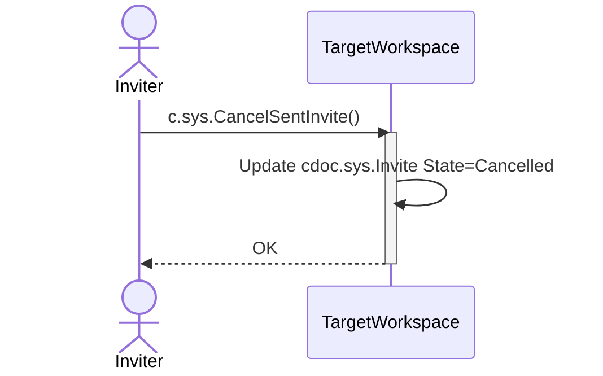

## c.sys.CancelSentInvite()

- AuthZ: role.sys.WorkspaceAdmin
- Params
    - InviteID
- Errors
    - State not in (Invited)

```mermaid
    sequenceDiagram

    actor inviter as Inviter
    participant workspace as TargetWorkspace

    inviter ->> workspace: c.sys.CancelSentInvite()
    activate workspace
        workspace ->> workspace: Update cdoc.sys.Invite State=Cancelled
        workspace -->> inviter: OK
    deactivate workspace
```
