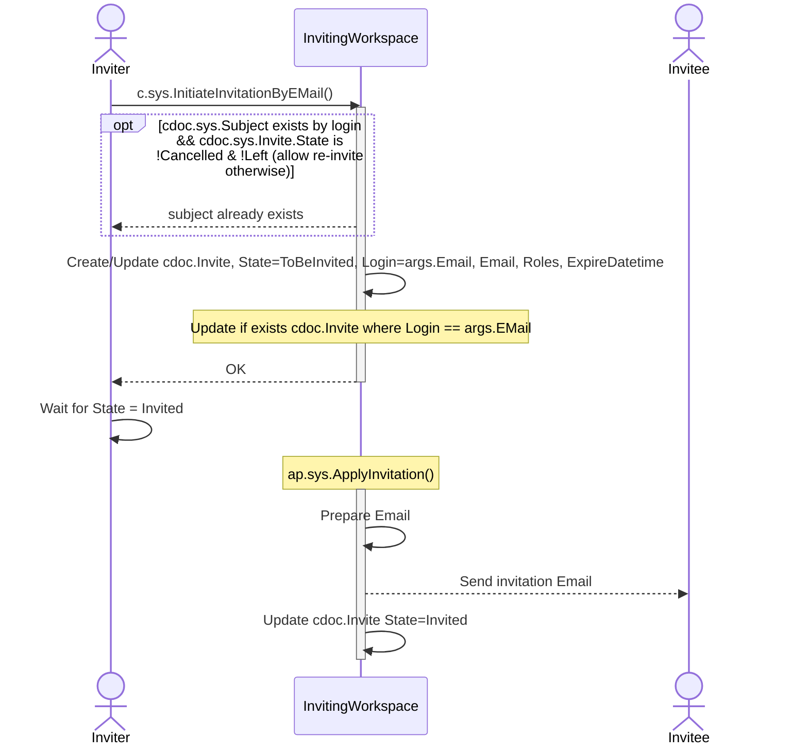

## c.sys.InitiateInvitationByEMail()

- AuthZ: role.sys.WorkspaceAdmin
- Params
    - Email
    - Roles
    - ExpireDatetime
    - EmailTemplate // Must be prefixed with 'text:' or 'resource:'
        - Placeholders:
            - ${VerificationCode}
            - ${InviteID}
            - ${WSID} - Inviting Workspace ID
            - ${WSName} - Inviting Workspace Name
            - ${Email} - Invitee Email
    - EmailSubject
- Errors
    - State not in (None, Cancelled, Left, Invited)
    - invalid argument EmailTemplate
- //TODO: EMail => Login must be implemented, currently it is supposed that EMail == Login

**Behavior:**
