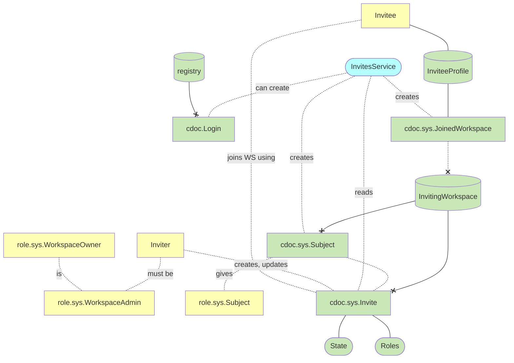
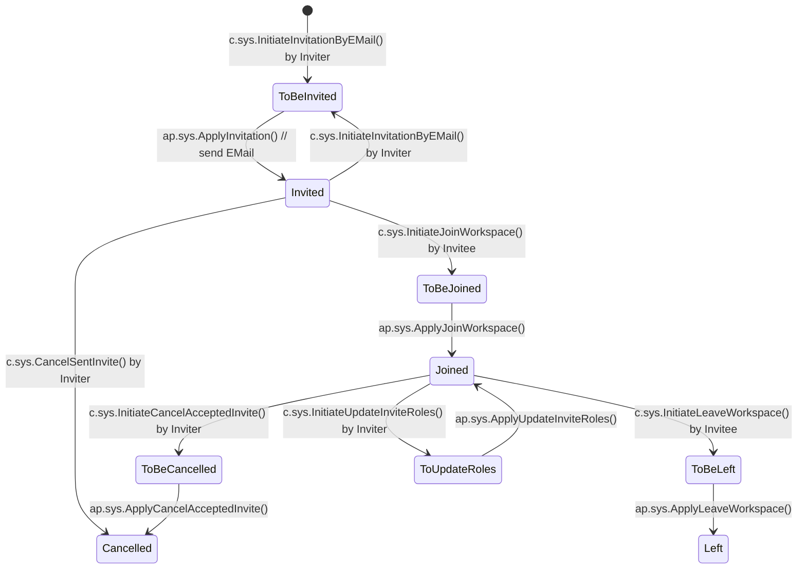
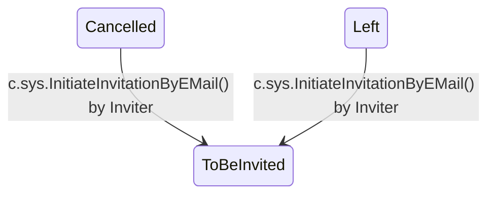

# Invites

Invite Users/Devices to Workspaces

## Overview

Roles and permissions:

- `WorkspaceOwner`: Highest level role, automatically has admin privileges
- `WorkspaceAdmin`: Can manage invites and user access

Key documents:

- `Invite`: Tracks invitation status and metadata
- `Subject`: Represents an invited user/device in the workspace
- `JoinedWorkspace`: Records workspace membership details
- `Login`: Manages user authentication and access

Invitation management:

- `c.InitiateInvitationByEmail`: Creates new invitation
  - Requires WorkspaceAdmin role
  - Includes email, roles, expiration, and email template
- `c.InitiateJoinWorkspace`: Processes invite acceptance
  - Requires verification code
  - Creates necessary workspace access records

Role management:

- `c.InitiateUpdateInviteRoles`: Updates member permissions
  - Available for joined members only
  - Includes email notification

Membership termination:

- `c.InitiateCancelAcceptedInvite`: Admin removes member
- `c.InitiateLeaveWorkspace`: Member voluntarily leaves
- `c.CancelSentInvite`: Cancels pending invitation

## Motivation

- [Air: Reseller Portal: Invite unTill Payments Users](625718)
- As a workspace owner I want to invite users into workspace with specified roles, so that if they accept it, they are granted to access my workspace\\
- As a workspace owner I want to change invited user's roles
- As a user, I want to see the list of my workspaces and roles, so that I know what am I available to work with
- As a user, I want to be able to leave the workspace I'm invited to
- As a workspace owner I want to ban user to he doesn't have access to my workspace anymore
- [Resellers Portal](https://github.com/untillpro/airs-design/blob/master/resellerportal/usersmgmt.md) 
- [invites.md](https://github.com/heeus/heeus-design/blob/d9b14d105ef443a2f70cc6fc8530ab42f36a6f5d/workspaces/invites.md)
- https://github.com/heeus/heeus-design/blob/main/workspaces/invites.md

## Concepts

## Invite state diagram

### Main sequence

### Extra

## C4 specification

- [C4: Invites](../arch/sys/c4.invites.md)