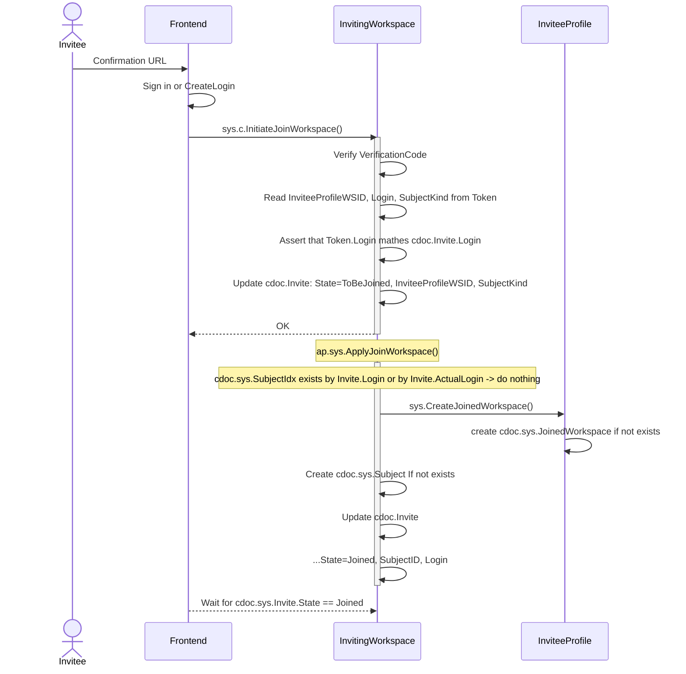

# Join Workspace

## c.sys.InitiateJoinWorkspace()

- `~Join.InitiateJoinWorkspace~`covered[^~Join.InitiateJoinWorkspace~]✅
- AuthZ: PrincipalToken + VerificationCode
  - `~Join.InitiateJoinWorkspace.AuthZ~`uncvrd[^~Join.InitiateJoinWorkspace.AuthZ~]❓
- Params
  - InviteID
  - VerificationCode
- Errors
  - Invite state is not in (Invited)
  - Invite does not exist
  - Invite expired
  - token login does not match invite login
  - wrong Verification Code

**Flow:**

## Footnotes

[^~Join.InitiateJoinWorkspace~]: `[~server.invites/Join.InitiateJoinWorkspace~impl]`, [invite/impl_initiatejoinworkspace.go:26:impl](https://github.com/voedger/voedger/blob/67cb0d8e2960a0b09546bf86a986bc40a1f05584/pkg/sys/invite/impl_initiatejoinworkspace.go#L26), [it/impl_invite_test.go:173:itest](https://github.com/voedger/voedger/blob/67cb0d8e2960a0b09546bf86a986bc40a1f05584/pkg/sys/it/impl_invite_test.go#L173)

[^~Join.InitiateJoinWorkspace.AuthZ~]: `[~server.invites/Join.InitiateJoinWorkspace.AuthZ~impl]`
