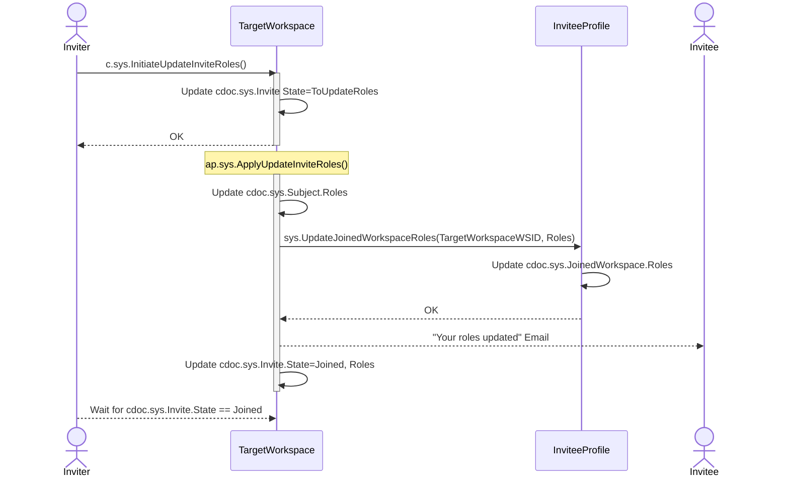

# Update Invite Roles

## c.sys.InitiateUpdateInviteRoles()

- AuthZ: role.sys.WorkspaceAdmin
- Params
  - InviteID
  - Roles
  - EmailTemplate // Must be prefixed with 'text:' or 'resource:'
  - EmailSubject
- Errors
  - State not in (Joined)
  - invalid argument EmailTemplate

**Behavior:**

