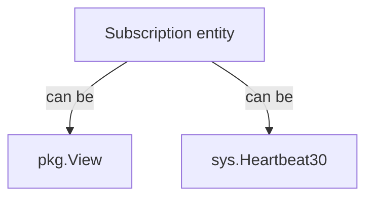

# Create channel, subscribe and start watching

## Motivation

As a client, I want to create a channel, subscribe and receive notifications about changes.

## Terms



## Functional Design

- The client initiates an SSE connection by making POST `/api/v2/apps/{owner}/{app}/notifications` with the payload containing the list of subscriptions.
- The connection is then kept open, allowing the server to stream events continuously.
- Client receives events, see [Result](#result)

### Request headers

| Key | Value |
| --- | --- |
| Content-Type | application/json |
| Accept | text/event-stream |
| Authorization | Bearer {PrincipalToken} |

### Parameters

| Parameter | Type | Description |
| --- | --- | --- |
| **Path** | | |
| owner | string | name of a user who owns the application |
| app | string | name of an application |
| wsid | int64 | the ID of workspace |
| **Headers** | | |
| PrincipalToken | string | Token returned by [login](../apiv2/login.md) |

### Authorization

- In order to create a channel, the client must provide a valid, non-expired `PrincipalToken` for the specified application in the `Authorization` header
- For every specified view in the subscription, the client must have `read` permission for that view in the specified workspace.

### Request body

JSON object:

```json
{
  "subscriptions": [
    {
      "entity": "sys.Heartbeat30",
      "wsid": 0
    },
    {
      "entity": "pkg.SalesView",
      "wsid": 100341234143
    }
    // more subscriptions can be added here
  ],
  "expiresInSeconds": 100, // optional, in seconds, default is 86400 (24h)
}
```

### Heartbeat

When `sys.Heartbeat30` is specified as the name of the subscription item, the server will send [heartbeat](./heartbeats.md) events every 30 seconds.
Event for the heartbeat contains "." as the name, and zero as the workspace ID.

### Result

When the connection is established, the server responds with:

```plaintext
Content-Type: text/event-stream
Cache-Control: no-cache
Connection: keep-alive
```

Then it starts sending events to the client. Each event is formatted as follows:

```plaintext
event: {event-name}
data: {event-data}
```

The first event is always a channel ID (uuid), which is used to identify the connection, example:

```plaintext
event: channelID
data: 123e4567-e89b-12d3-a456-426614174000
```

The subsequent events contain updates for the subscription items, where `{event-name}` is `update`, and `{event-data}` is the JSON object containing the details of the update. Example view update event:

```plaintext
event: update
data: {"app":"myapp", "item":"pkg.SalesView", "wsid":0, "offset": 0}

event: update
data: {"app":"myapp", "item":".", "wsid":100341234143, "offset": 1234567890}
```

The `{event-data}` is an UTF-8 encoded text. Each event ends with a double newline (\n\n)

In case of an error, the server responds with an HTTP error:

| Code | Description | Body |
| --- | --- | --- |
| 400 | Bad Request | [error object](errors.md) |
| 401 | Unauthorized | [error object](errors.md) |
| 403 | Forbidden, client has no permissions to read from view | [error object](errors.md) |
| 429 | Too may requests, rate limiting | [error object](cerrors.md) |
| 500+ | Server errors / service unavailable | [error object](errors.md) |

## Technical design

### Components

#### pkg/router

url path handler

#### pkg/sys/it

integration tests
