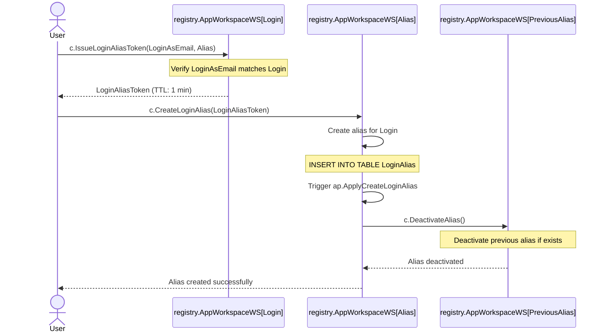

# Login Alias

## Background

Best practices

- Instagram allows users to change their username multiple times

## 🏡Principles

- Instead of changing the login we are creating an alias, so old login is kept and can be used to log in
  - Rationale: Login value is used extensively in the data, so it is hard to change the value
- Alias can be changed
  - Previous alias is deactivated and can be re-used

## Architecture

### Create Login Alias

- User calls `c.IssueLoginAliasToken` in registry.AppWorkspaceWS[Login] to create an alias for their Login
- `c.CreateLoginAlias` returns a `LoginAliasToken`
  - A short-lived token that keeps NewAlias and PreviousAlias
- User calls `c.CreateLoginAlias` in registry.AppWorkspaceWS[Alias] with LoginAliasToken as a parameter
- `c.CreateLoginAlias` creates an alias for the Login and triggers `ap.ApplyCreateLoginAlias`
  - cdoc.LoginAlias
- `ap.ApplyCreateLoginAlias` invokes `c.DeactivateAlias` in registry.AppWorkspaceWS[PreviousAlias]
- `c.DeactivateAlias` deactivates the previous alias, if exists

### IssuePrincipalToken for Alias

- User calls `q.IssuePrincipalToken` in registry.AppWorkspaceWS[Alias]
- `q.IssuePrincipalToken` reads `cdoc.LoginAlias` and routes the request to the Login workspace

## Components

## cdoc.LoginAlias

- `cdoc.LoginAlias`: Keeps the alias for the Login
- Fields:
  - `Login`: the Login of the user
  - `Alias`: the alias for the Login
  - `PreviousAlias`: the previous alias, if exists
  - `CreatedAt`: timestamp when the alias was created
  - `ExpiresAt`: timestamp when the alias expires (if applicable)

## c.IssueCreateAliasToken

- `c.IssueCreateAliasToken`: Called by the user to issue a CreateAliasToken
- Workspace: registry.AppWorkspaceWS[Login]
- AuthZ: ??? How to name the role for authenticated user
- Parameters:
  - LoginAsEmail: verified, must match the Login
  - Alias: the new alias to be created
- Errors:
  - LoginAsEmail does not match the Login
  - Workspace is not the Login workspace
- Behavior:
  - Creates a `cmp.LoginAliasToken` with TTL of 1 minute
  - PreviousAlias (may be empty)
  - NewAlias

registry.AppWorkspaceWS:

- `~c.IssueCreateAliasToken~`: Called by the user to issue a CreateAliasToken
  - AuthZ: ??? How to name the role for authenticated user
  - Parameters:
    - LoginAsEmail: verified, must match the Login
    - Alias: the new alias to be created
  - `cmp.LoginAliasToken`:
    - TTL is 1 minute
    - PreviousAlias (may be empty)
    - NewAlias
- `c.CreateAlias`: Called by the user to create an alias for their Login
  - Workspace: Alias pseudo-workspace
  - Bevarior:
    - Creates an alias for the Login
    - Triggers ap.ApplyCreateAlias
- `ap.ApplyCreateAlias`: Triggered by CreateAlias
  - Workspace: same as CreateAlias
  - Invokes DeactivateAlias in the workspace of the PreviousAlias
- `c.DeactivateAlias`: Invoked by ApplyCreateAlias
  - Called by the system only to deactivate the alias

## Related work

- [20250617-change-email/README.md](../../rsch/20250617-change-email/README.md)
