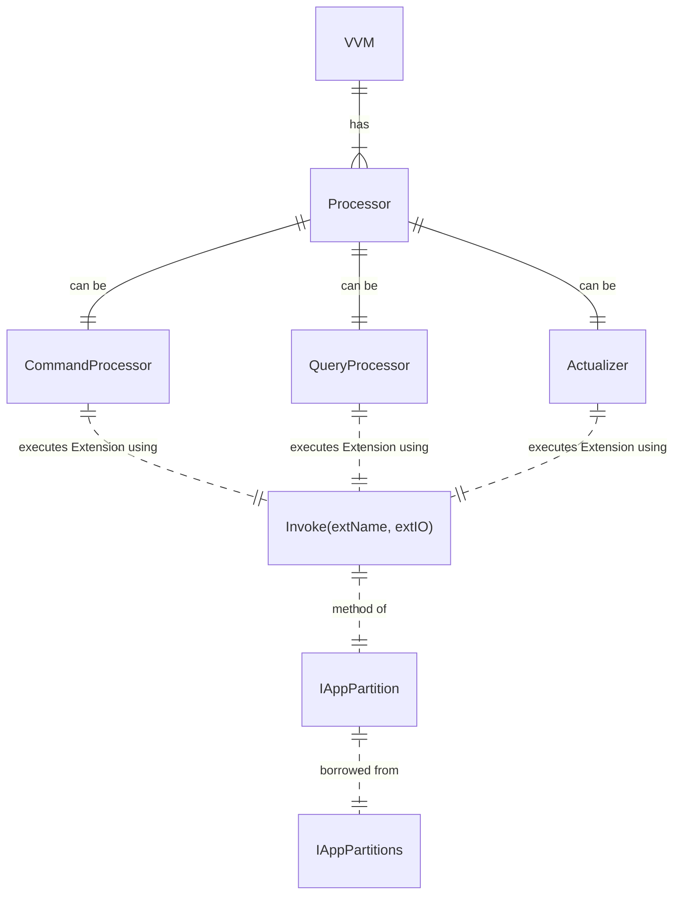
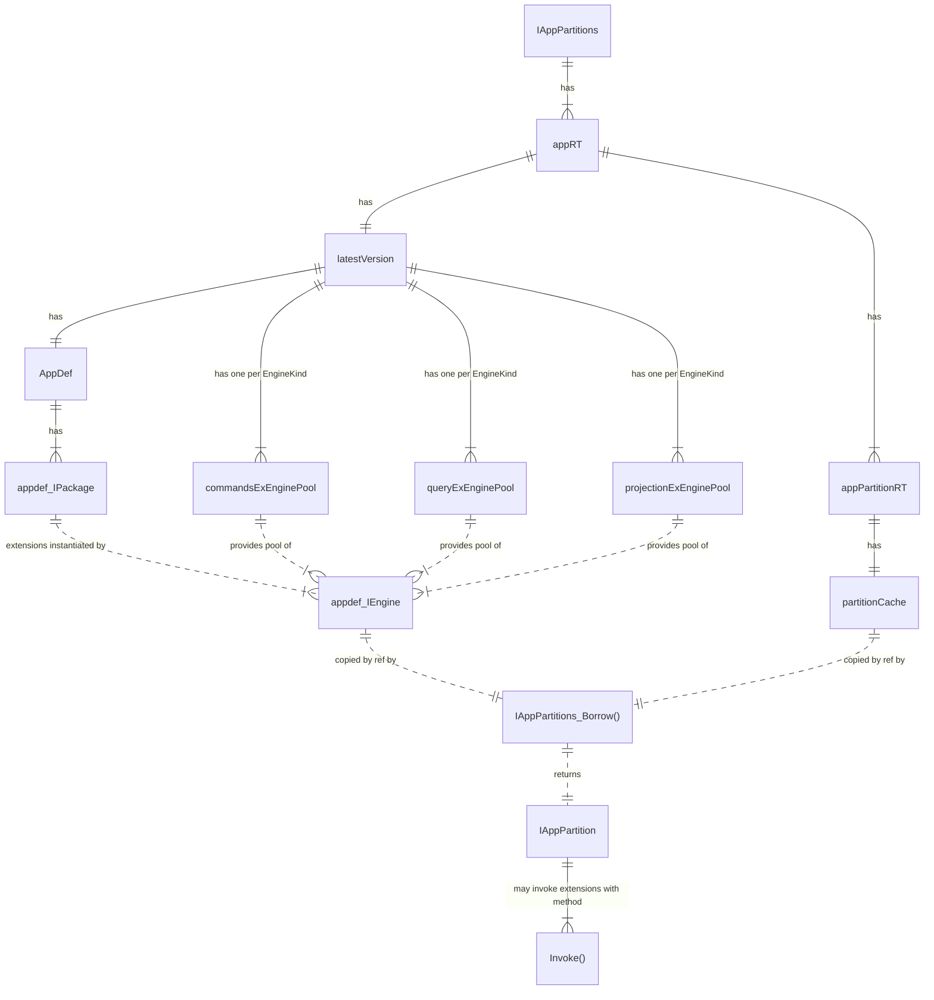

## Processors


```mermaid
    erDiagram
    
    %% Entities

    %% Relations

    VVM ||--|{ Processor : "has"

    Processor ||--|| CommandProcessor : "can be"
    Processor ||--|| QueryProcessor : "can be"
    Processor ||--|| Actualizer : "can be"   

    CommandProcessor ||..|| "Invoke(extName, extIO)": "executes Extension using"
    QueryProcessor ||..|| "Invoke(extName, extIO)": "executes Extension using"
    Actualizer ||..|| "Invoke(extName, extIO)": "executes Extension using"

    "Invoke(extName, extIO)" ||..|| IAppPartition: "method of"


    IAppPartition ||..|| IAppPartitions: "borrowed from"
```

## IAppPartition

```go
type IAppPartitions interface {
    ...
    Borrow(qpp AppQName, part PartitionID, procKind ProcessorKind) (IAppPartition, error)
    ...
}
```


```mermaid
    erDiagram

    IAppPartitions ||--|{ appRT : "has"

    appRT ||--|{ appPartitionRT : "has"

    appRT ||--|| latestVersion : "has"
    appPartitionRT ||--|| partitionCache : "has"

    latestVersion ||--|| AppDef : "has"
    latestVersion  ||--|{ commandsExEnginePool : "has one per EngineKind"
    latestVersion  ||--|{ queryExEnginePool : "has one per EngineKind"
    latestVersion  ||--|{ projectionExEnginePool : "has one per EngineKind"


    AppDef ||--|{ appdef_IPackage : "has"
    appdef_IPackage ||..|{ appdef_IEngine: "extensions instantiated by"

    appdef_IEngine ||..|| "IAppPartitions_Borrow()": "copied by ref by"
    
    commandsExEnginePool ||..|{ "appdef_IEngine": "provides pool of"
    queryExEnginePool ||..|{ "appdef_IEngine": "provides pool of"
    projectionExEnginePool ||..|{ "appdef_IEngine": "provides pool of"
    partitionCache ||..|| "IAppPartitions_Borrow()": "copied by ref by"

    "IAppPartitions_Borrow()" ||..|| "IAppPartition": "returns"

    IAppPartition ||--|{ "Invoke()" : "may invoke extensions with method"
```